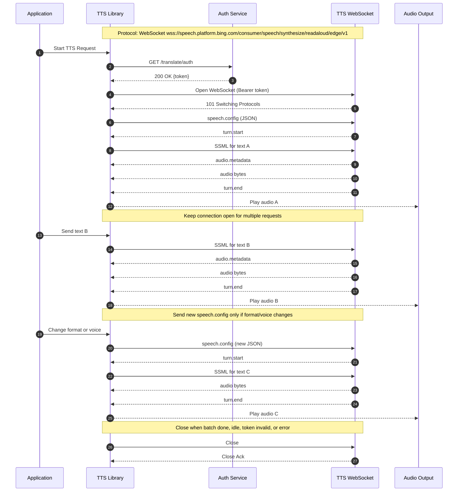

# Hello TTS

A comprehensive multi-language demonstration suite showcasing text-to-speech functionality using both **Microsoft Edge TTS** and **Google TTS** services. This project provides production-ready examples in **Python**, **Dart**, **Rust**, and **Java**, each implementing advanced TTS features including voice synthesis, SSML support, batch processing, cross-platform audio playback, and backend switching capabilities.

## 🎯 Overview

The hello-tts project demonstrates how to integrate with both Microsoft Edge's and Google's text-to-speech services across different programming languages and paradigms. Each implementation follows consistent API patterns while leveraging language-specific best practices, performance optimizations, and idiomatic code styles.

**Perfect for:**

- Learning TTS integration with multiple backends across different languages
- Comparing async programming patterns
- Understanding cross-platform audio handling
- Building production TTS applications with backend flexibility
- Educational and research purposes

## 🎯 Architecture Overview

The hello-tts project demonstrates consistent TTS integration patterns across different programming languages and backends, each following the same core workflow:



## ✨ Features

### Core TTS Functionality

- 🎤 **High-quality speech synthesis** using Microsoft Edge TTS service
- 🌍 **400+ voices** across 140+ languages and locales
- 🎵 **SSML support** for advanced speech control (rate, pitch, emphasis, breaks)
- 📁 **Multiple audio formats** (MP3, WAV, OGG)
- 🔄 **Batch processing** for multiple texts
- ⚡ **Concurrent processing** for improved performance

### Advanced Features

- 🎛️ **Voice filtering and management** by language, gender, and region
- ⚙️ **Configuration management** with JSON/YAML support
- 🔊 **Cross-platform audio playback** with multiple backend support
- 🛡️ **Comprehensive error handling** and retry logic
- 📊 **Performance optimization** with caching and connection pooling
- 🎯 **Consistent API design** across all language implementations

### Developer Experience

- 📚 **Extensive documentation** with examples and troubleshooting
- 🧪 **Unit and integration tests** for reliability
- 🚀 **Easy setup** with package managers
- 🔧 **IDE integration** support
- 📈 **Performance benchmarking** tools

## 🚀 Language Implementations

| Language      | Async Pattern             | Key Libraries                          | Strengths                          | Best For                                  |
| :------------ | :------------------------ | :------------------------------------- | :--------------------------------- | :---------------------------------------- |
| **🐍 Python** | `async`/`await`           | `edge-tts`, `pygame`, `aiofiles`       | Rapid development, rich ecosystem  | Scripting, AI/ML integration, prototyping |
| **🎯 Dart**   | `Future`/`async`/`await`  | `http`, `args`, native audio           | Cross-platform, strong typing      | Flutter apps, web development, mobile     |
| **🦀 Rust**   | `async`/`await` + `tokio` | `reqwest`, `rodio`, `serde`            | Memory safety, performance         | System programming, high-performance apps |
| **☕ Java**   | `CompletableFuture`       | `HttpClient`, `Jackson`, `javax.sound` | Enterprise features, JVM ecosystem | Enterprise applications, Android apps     |

### Implementation Highlights

#### 🐍 Python Implementation

- **Runtime**: Python 3.7+ (3.9+ recommended)
- **Async Model**: Native async/await with asyncio
- **Audio Backends**: pygame (primary), playsound (fallback)
- **Unique Features**: Rich CLI with argparse, extensive SSML utilities
- **Performance**: Excellent for I/O-bound operations, GIL limitations for CPU-bound tasks

#### 🎯 Dart Implementation

- **Runtime**: Dart SDK 2.17+ (3.0+ recommended)
- **Async Model**: Future-based with isolates support
- **Audio Backends**: Platform-specific native audio
- **Unique Features**: Strong null safety, Flutter integration ready
- **Performance**: Fast startup, efficient memory usage, good concurrency

#### 🦀 Rust Implementation

- **Runtime**: Rust 1.60+ (1.70+ recommended)
- **Async Model**: tokio runtime with zero-cost abstractions
- **Audio Backends**: rodio with multiple platform backends
- **Unique Features**: Memory safety, zero-cost abstractions, excellent error handling
- **Performance**: Highest performance, lowest memory footprint, no GC overhead

#### ☕ Java Implementation

- **Runtime**: Java 21+ (LTS with modern features and performance improvements)
- **Async Model**: CompletableFuture with virtual threads and structured concurrency
- **Audio Backends**: javax.sound.sampled (built-in)
- **Unique Features**: Enterprise-grade features, extensive tooling, JVM optimization, modern Java features
- **Performance**: Excellent JIT optimization, mature profiling tools, good scalability, enhanced GC

## 🎛️ TTS Backend Support

This project supports multiple TTS backends, allowing you to choose the best service for your needs:

### Microsoft Edge TTS

- **Pros**: High-quality voices, SSML support, 300+ voices in 100+ languages, free usage
- **Cons**: Requires internet connection, Microsoft service dependency
- **Best for**: Production applications, multilingual content, high-quality speech

### Google TTS

- **Pros**: Reliable service, good language coverage, simple API
- **Cons**: Fewer voice options compared to Edge TTS, requires API quota management
- **Best for**: Simple applications, consistent service availability

### Backend Selection

You can choose the backend when running the applications:

```bash
# Using Edge TTS (default)
./run.sh --language english --backend edge

# Using Google TTS
./run.sh --language english --backend google

# Test both backends
./test_backends.sh --text "Hello, this is a test"
```

## 🚀 Quick Start

### Prerequisites

- Internet connection for TTS service access
- Audio playback capabilities (speakers/headphones)
- Language-specific runtime (see individual sections)

### 🆕 Recent Updates (August 2025)

- **Java Implementation**: Upgraded to Java 21 LTS with enhanced performance and modern features
- **Build System**: Eliminated all Maven warnings and improved JAR packaging
- **Dependencies**: Updated to latest stable versions for security and performance
- **Documentation**: Comprehensive guides updated with latest requirements

### Choose Your Language

#### 🐍 Python (Recommended for Beginners)

```bash
# Navigate to Python directory
cd hello-tts-python
# Create virtual environment (recommended)
python -m venv venv
source venv/bin/activate  # On Windows: venv\Scripts\activate
# Install dependencies
pip install -r requirements.txt
# Run basic example
python hello_tts.py
python hello_tts.py --text 'Hello from Python!' --voice 'en-US-JennyNeural'
python advanced_tts.py --demo ssml
```

#### 🎯 Dart (Great for Cross-Platform)

````bash
```bash
# Navigate to Dart directory
cd hello-tts-dart

# Get dependencies
dart pub get

# Run basic example
dart run bin/main.dart
dart run bin/main.dart --text 'Hello from Dart!' --voice 'en-US-JennyNeural'
dart compile exe bin/main.dart -o hello_tts
````

./hello_tts --list-voices

````

#### 🦀 Rust (Best Performance)

```bash
# Navigate to Rust directory
cd rust

# Build project
cargo build

# Run basic example
cargo run

# Try with arguments
cargo run -- --text 'Hello from Rust!' --voice 'en-US-AriaNeural'

# Build optimized release
cargo build --release
./target/release/hello-edge-tts --help
````

#### ☕ Java (Enterprise Ready - Java 21 LTS)

```bash
# Navigate to Java directory
cd hello-tts-java
mvn compile

# Run basic example
mvn exec:java -Dexec.mainClass='com.example.hellotts.HelloTTS'
mvn exec:java -Dexec.mainClass='com.example.hellotts.HelloTTS' \
  -Dexec.args='--text '\''Hello from Java 21!'\'' --voice en-US-GuyNeural'
mvn package
java -jar target/hello-tts-standalone.jar --help
```

### 🎯 One-Liner Examples

```bash
# Python: Quick synthesis
python python/hello_tts.py --text 'Welcome to TTS!' --output welcome.mp3

# Dart: List available voices
dart run dart/bin/main.dart --list-voices | head -20

# Rust: Batch processing
echo 'Hello\nWorld\nFrom Rust' | cargo run --manifest-path rust/Cargo.toml -- --batch

# Java: SSML example
mvn exec:java -f java/pom.xml -Dexec.args='--ssml "<speak>Hello <break time=\"1s\"/> World!</speak>"'
```

For detailed setup instructions and advanced usage, see the language-specific README files:

- 📖 [Python Implementation](./python/README.md) - Comprehensive async examples
- 📖 [Dart Implementation](./dart/README.md) - Cross-platform development
- 📖 [Rust Implementation](./rust/README.md) - High-performance systems
- 📖 [Java Implementation](./java/README.md) - Enterprise applications
