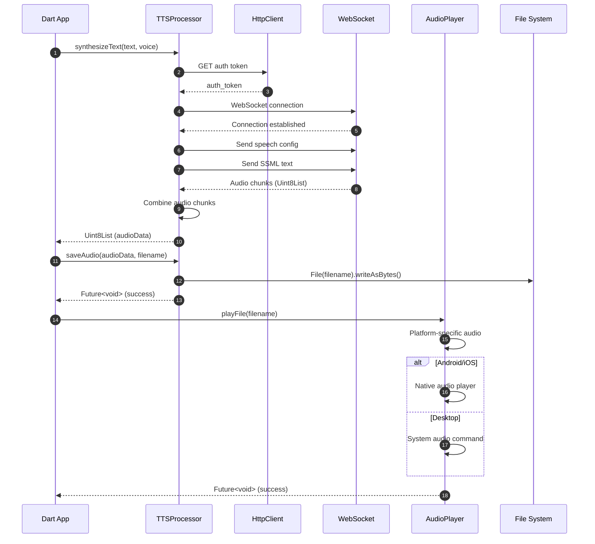

# hello_tts_dart

This package consolidates the Microsoft Edge TTS and Google gTTS backends into a
single, easy-to-use Dart implementation. It provides a CLI and an importable API.

## Features

- **Dual Backend Support**: Both Edge TTS and Google TTS
- **Cross-platform**: Works on Windows, macOS, and Linux
- **Audio Playback**: Built-in audio playback capabilities
- **Voice Management**: List and filter available voices
- **Flexible Output**: Multiple audio formats supported

## Prerequisites

1. **Edge TTS**: Install the Python edge-tts package

```bash
pip install edge-tts
```

2. **Google TTS**: Install the Python gTTS package

```bash
pip install gTTS
```

## Setup

1. Install Dart dependencies:

```bash
cd hello_tts_dart
dart pub get
```

## Usage

### CLI Examples

```bash
# Edge TTS examples
dart run bin/main.dart --backend edge --text "Hello World" --voice "en-US-JennyNeural"
dart run bin/main.dart --backend edge --text "你好世界" --voice "zh-CN-XiaoxiaoNeural"

# Google TTS examples
dart run bin/main.dart --backend google --text "Hello World" --voice "en"
dart run bin/main.dart --backend google --text "你好世界" --voice "zh"

# List available voices
dart run bin/main.dart --list-voices
dart run bin/main.dart --list-voices --language en

# Save to specific file
dart run bin/main.dart --backend edge --text "Hello" --voice "en-US-AriaNeural" --output hello.mp3

# Help
dart run bin/main.dart --help
```

### Command Line Options

- `--backend, -b`: TTS backend (`edge` or `google`, default: `edge`)
- `--text, -t`: Text to synthesize
- `--voice, -v`: Voice to use
- `--output, -o`: Output file path
- `--format, -f`: Audio format (`mp3`, `wav`, `ogg`)
- `--list-voices`: List available voices
- `--language, -l`: Filter voices by language
- `--play`: Play audio after synthesis (default: true)
- `--no-play`: Don't play audio after synthesis
- `--help, -h`: Show help

## References

- [Microsoft Edge TTS](https://github.com/rany2/edge-tts)
- [Google Text-to-Speech](https://github.com/pndurette/gTTS)

## 🏗️ Dart Implementation Architecture

The Dart implementation uses Future-based async programming with strong type safety:



## ✨ Features

- ✅ **Future-based async TTS synthesis** with Dart's async/await
- ✅ **HTTP client communication** for Edge TTS API integration
- ✅ **Strong type safety** with Dart's null-safe type system
- ✅ **SSML support** for advanced speech markup language
- ✅ **Voice filtering and management** with language/gender filtering
- ✅ **Batch text processing** capabilities with concurrent futures
- ✅ **Configuration management** with JSON support
- ✅ **Comprehensive error handling** with custom exception types
- ✅ **Cross-platform audio playback** with native platform support
- ✅ **Command-line interface** with args package

## 📋 Prerequisites

- **Dart SDK**: 2.17+ (Dart 3.0+ recommended for latest features)
- **Package Manager**: pub (included with Dart SDK)
- **Internet Connection**: Required for TTS service access
- **Audio System**: Speakers/headphones for audio playback
- **Optional**: Flutter SDK (for mobile/desktop app integration)

## 🚀 Quick Start

```bash
# Navigate to Dart directory
cd hello-edge-tts-dart

# Get dependencies
dart pub get

# Run basic example
dart run bin/main.dart

# Try with custom text and voice
dart run bin/main.dart --text "Hello from Dart!" --voice "en-US-JennyNeural"

# Compile to executable (optional)
dart compile exe bin/main.dart -o hello_tts
./hello_tts --list-voices
```

## 💡 Usage Examples

### Basic Text-to-Speech

```bash
# Simple synthesis with default voice
dart run bin/main.dart --text "Welcome to Dart TTS!"

# Use specific voice
dart run bin/main.dart --text "Hello World" --voice "en-US-AriaNeural"

# Save to specific file
dart run bin/main.dart --text "Save me!" --output "my_speech.mp3"
```

### Voice Discovery

```bash
# List all available voices
dart run bin/main.dart --list-voices

# Filter voices by language
dart run bin/main.dart --language "es"

# Find voices by gender
dart run bin/main.dart --list-voices | grep "Female"
```

### Advanced Features

```bash
# SSML synthesis
dart run bin/main.dart --ssml '<speak>Hello <break time="1s"/> World!</speak>'

# Advanced features (integrated in main.dart)
dart run bin/main.dart --demo batch

# Compiled executable usage
./hello_tts --text "Fast execution!" --voice "en-US-DavisNeural"
```

## 📁 Project Structure

```
hello-edge-tts-dart/
├── 📄 README.md              # This documentation
├── 📦 pubspec.yaml           # Dependencies and project configuration
├── 🎯 bin/
│   └── main.dart             # CLI application entry point
├── 📚 lib/
│   ├── hello_tts.dart        # Main TTS functionality
│   ├── tts_client.dart       # TTS client implementation
│   ├── audio_player.dart     # Audio playback handling
│   ├── config_manager.dart   # Configuration management
│   └── voice.dart            # Voice model and utilities
├── 🧪 test/
│   ├── tts_test.dart         # Unit tests
│   └── integration_test.dart # Integration tests

```

## 📦 Dependencies

| Package   | Version  | Purpose                           |
| --------- | -------- | --------------------------------- |
| `http`    | ^0.13.5  | HTTP client for API communication |
| `args`    | ^2.4.0   | Command-line argument parsing     |
| `path`    | ^1.8.3   | File path utilities               |
| `convert` | Built-in | JSON/data conversion              |
| `io`      | Built-in | File system operations            |

## 🔧 API Reference

### TTSProcessor

Main class for TTS operations with Future-based async methods.

```dart
class TTSProcessor {
  Future<Uint8List> synthesizeText(String text, String voice, {bool useSSML = false});
  Future<Uint8List> synthesizeSSML(String ssml);
  Future<void> saveAudio(Uint8List audioData, String filename);
  Future<List<Voice>> listVoices();
  Future<List<Voice>> getVoicesByLanguage(String language);
}
```

### AudioPlayer

Handles audio playback functionality.

```dart
class AudioPlayer {
  Future<void> playFile(String filename);
  Future<void> playAudioData(Uint8List audioData, {String formatHint = 'mp3'});
  List<String> getAvailableBackends();
}
```

### Voice

Represents voice information and metadata.

```dart
class Voice {
  final String name;
  final String displayName;
  final String locale;
  final String gender;

  String get languageCode;
  String get countryCode;
  bool matchesLanguage(String language);
}
```

## ⚡ Performance Characteristics

| Metric                     | Dart Implementation | Comparison                        |
| -------------------------- | ------------------- | --------------------------------- |
| **Startup Time**           | ~100ms              | Fast startup                      |
| **Memory Usage**           | ~25MB active        | Efficient memory usage            |
| **Synthesis Speed**        | Good                | Balanced performance              |
| **Concurrent Performance** | Excellent           | Isolates for true parallelism     |
| **Development Speed**      | Good                | Strong typing aids development    |
| **Cross-Platform**         | Excellent           | Single codebase, multiple targets |

### Strengths

- 🎯 **Strong Typing**: Null-safe type system
- 📱 **Cross-Platform**: Single codebase for all platforms
- ⚡ **Fast Compilation**: Quick development cycles
- 🔄 **Isolates**: True parallelism without shared memory

### Best Use Cases

- 📱 **Flutter Apps**: Perfect for mobile/desktop apps
- 🌐 **Web Development**: Compile to JavaScript
- 🖥️ **Desktop Apps**: Native desktop applications
- 🔄 **Cross-Platform**: Single codebase deployment

---

## 🔗 Related Links

- 📖 [Main Project README](../README.md) - Complete project overview
- 🐍 [Python Implementation](../hello-edge-tts-python/README.md) - Rapid development alternative
- 🦀 [Rust Implementation](../hello-edge-tts-rust/README.md) - High-performance alternative
- ☕ [Java Implementation](../hello-edge-tts-java/README.md) - Enterprise alternative

## 📞 Support

For Dart-specific issues:

1. Check the troubleshooting section above
2. Review the [main project documentation](../README.md)
3. Search existing GitHub issues
4. Create a new issue with the `dart` label

**Happy coding with Dart! 🎯**

- ✅ Batch text processing capabilities
- ✅ Configuration management with JSON support
- ✅ Comprehensive error handling
- ✅ Cross-platform audio playback
- ✅ Command-line interface with args package

## Prerequisites

- Dart SDK 2.17 or higher (Dart 3.0+ recommended)
- Internet connection for TTS service access
- Audio playback capabilities (speakers/headphones)
- Optional: Flutter SDK (for mobile/desktop apps)

## Quick Start

1. Navigate to the dart directory:

```bash
cd dart
```

2. Get dependencies:

```bash
dart pub get
```

3. Run basic example:

```bash
dart run bin/main.dart
```

4. Compile to executable (optional):

```bash
dart compile exe bin/main.dart -o hello_tts
./hello_tts
```

## Usage

### Basic Usage

Run the basic TTS example:

```bash
dart run bin/main.dart
```

This will convert "Hello, World!" to speech using the default voice and save it as an audio file.

### Advanced Usage

Run with custom text and voice:

```bash
dart run bin/main.dart --text "Your custom text here" --voice "en-US-JennyNeural"
```

### Available Options

- `--text`: Text to convert to speech
- `--voice`: Voice to use (default: en-US-AriaNeural)
- `--output`: Output filename (default: auto-generated)
- `--play`: Play audio after generation (default: true)
- `--list-voices`: List all available voices

## Examples

### List Available Voices

```bash
dart run bin/main.dart --list-voices
```

### Generate Speech with Different Voice

```bash
dart run bin/main.dart --text "Hello from Dart!" --voice "en-US-DavisNeural"
```

### Save to Specific File

```bash
dart run bin/main.dart --text "Save me!" --output "my_speech.mp3"
```

## Project Structure

```
dart/
├── README.md
├── pubspec.yaml          # Dependencies and project configuration
├── lib/
│   ├── hello_tts.dart    # Main TTS functionality
│   └── tts_service.dart  # TTS service implementation
└── bin/
    └── main.dart         # Command-line interface
```

## Dependencies

- `http`: HTTP client for API communication
- `args`: Command-line argument parsing
- `path`: File path utilities
- `io`: File system operations

## Troubleshooting

### Common Issues

#### 1. Installation and Dependencies

**Package Resolution Issues**

```bash
# Clean and reinstall dependencies
dart pub deps
dart pub get

# Clear pub cache if needed
dart pub cache clean
dart pub get

# Check Dart SDK version
dart --version
```

**Dart SDK Version Issues**

```bash
# Update Dart SDK
# Using Homebrew (macOS)
brew upgrade dart

# Using Chocolatey (Windows)
choco upgrade dart-sdk

# Using apt (Ubuntu/Debian)
sudo apt update && sudo apt upgrade dart
```

#### 2. Compilation and Runtime Issues

**Compilation Errors**

```bash
# Check for syntax errors
dart analyze

# Compile with verbose output
dart compile exe bin/main.dart -o hello_tts --verbose

# Run with type checks
dart run --enable-asserts bin/main.dart
```

**Runtime Exceptions**

- Check null safety compliance
- Verify async/await usage
- Ensure proper exception handling

#### 3. Network and HTTP Issues

**Connection Problems**

```bash
# Test network connectivity
ping microsoft.com

# Check HTTP client configuration
# Verify proxy settings if behind corporate firewall
```

**SSL/TLS Issues**

```dart
// In your code, handle certificate issues
import 'dart:io';

HttpClient client = HttpClient();
client.badCertificateCallback = (cert, host, port) => true; // Only for testing
```

#### 4. Audio Playback Issues

**Platform-Specific Audio Issues**

**Windows:**

```bash
# Ensure Windows Media Feature Pack is installed
# Check audio drivers and system volume
```

**macOS:**

```bash
# Check audio permissions in System Preferences
# Verify audio output device selection
```

**Linux:**

```bash
# Install audio libraries
sudo apt-get install libasound2-dev  # Ubuntu/Debian
sudo dnf install alsa-lib-devel      # Fedora

# Check PulseAudio/ALSA configuration
pulseaudio --check -v
```

#### 5. File System and Permissions

**File Access Issues**

```bash
# Check write permissions
mkdir -p output
chmod 755 output

# Verify file paths (use absolute paths if needed)
dart run bin/main.dart --output "/absolute/path/to/output.mp3"
```

### Error Messages and Solutions

| Error Message            | Cause                  | Solution                                     |
| ------------------------ | ---------------------- | -------------------------------------------- |
| `Package not found`      | Missing dependencies   | Run `dart pub get`                           |
| `Audio device not found` | Audio system issue     | Check system audio configuration             |
| `Connection timeout`     | Network issue          | Check internet connection and firewall       |
| `Invalid voice name`     | Wrong voice identifier | Use `--list-voices` to see available options |
| `FormatException`        | JSON parsing error     | Check API response format                    |
| `FileSystemException`    | File access issue      | Verify file permissions and paths            |
| `SocketException`        | Network connectivity   | Check internet connection                    |
| `HttpException`          | HTTP request failed    | Verify API endpoint and parameters           |

### Performance Issues

**Slow HTTP Requests**

```dart
// Increase timeout values
final client = HttpClient();
client.connectionTimeout = Duration(seconds: 30);
client.idleTimeout = Duration(seconds: 30);
```

**Memory Usage**

```dart
// Dispose of HTTP clients properly
await client.close();

// Handle large audio files efficiently
// Process in chunks for very large texts
```

### Platform-Specific Considerations

#### Flutter Integration

```dart
// For Flutter apps, add to pubspec.yaml:
dependencies:
  flutter:
    sdk: flutter
  http: ^0.13.5
  path_provider: ^2.0.11

// Handle platform-specific file paths
import 'package:path_provider/path_provider.dart';

Future<String> getOutputPath() async {
  final directory = await getApplicationDocumentsDirectory();
  return directory.path;
}
```

#### Web Platform

```dart
// For web deployment, handle CORS issues
// Use appropriate HTTP headers
final headers = {
  'Content-Type': 'application/json',
  'Access-Control-Allow-Origin': '*',
};
```

### Development Tips

1. **Use Dart DevTools**: `dart devtools` for debugging
2. **Enable null safety**: Ensure your code is null-safe
3. **Use strong typing**: Leverage Dart's type system
4. **Handle futures properly**: Always await async operations
5. **Test thoroughly**: Use `dart test` for unit testing

## Advanced Usage and Examples

### 1. Basic Library Usage

```dart
import 'dart:io';
import 'lib/hello_tts.dart';

Future<void> basicExample() async {
  final client = TTSProcessor();

  try {
    // Synthesize text
    final audioData = await client.synthesizeText(
      'Hello from Dart!',
      'en-US-AriaNeural'
    );

    // Save to file
    await client.saveAudio(audioData, 'hello.mp3');

    // Play audio
    final player = AudioPlayer();
    await player.playFile('hello.mp3');

    print('TTS synthesis completed successfully!');
  } catch (e) {
    print('Error: $e');
  }
}

void main() async {
  await basicExample();
}
```

### 2. Voice Discovery and Management

```dart
import 'lib/tts_service.dart';

Future<void> voiceDiscovery() async {
  final client = TTSProcessor();

  try {
    // Get all available voices
    final allVoices = await client.listVoices();
    print('Total voices available: ${allVoices.length}');

    // Filter voices by language
    final englishVoices = await client.getVoicesByLanguage('en');
    print('English voices: ${englishVoices.length}');

    // Group voices by gender
    final femaleVoices = englishVoices.where((v) => v.gender == 'Female').toList();
    final maleVoices = englishVoices.where((v) => v.gender == 'Male').toList();

    print('Female voices: ${femaleVoices.length}');
    print('Male voices: ${maleVoices.length}');

    // Test different voices
    for (final voice in englishVoices.take(3)) {
      print('Testing voice: ${voice.displayName}');

      final audioData = await client.synthesizeText(
        'Hello, I am ${voice.displayName}',
        voice.name
      );

      final filename = 'voice_${voice.name.replaceAll('-', '_')}.mp3';
      await client.saveAudio(audioData, filename);
      print('Saved: $filename');
    }
  } catch (e) {
    print('Voice discovery error: $e');
  }
}
```

### 3. SSML Support

```dart
import 'lib/ssml_utils.dart';

Future<void> ssmlExamples() async {
  final client = TTSProcessor();
  final voice = 'en-US-AriaNeural';

  // Basic SSML with prosody controls
  final ssmlWithProsody = '''
    <speak version="1.0" xmlns="http://www.w3.org/2001/10/synthesis" xml:lang="en-US">
      <voice name="$voice">
        This is <prosody rate="slow">slow speech</prosody> and
        this is <prosody rate="fast">fast speech</prosody>.
        <break time="1s"/>
        Now with <prosody pitch="high">high pitch</prosody> and
        <prosody pitch="low">low pitch</prosody>.
      </voice>
    </speak>
  ''';

  try {
    final audioData = await client.synthesizeSSML(ssmlWithProsody);
    await client.saveAudio(audioData, 'ssml_prosody.mp3');

    // SSML with emphasis and breaks
    final ssmlWithEmphasis = '''
      <speak version="1.0" xmlns="http://www.w3.org/2001/10/synthesis" xml:lang="en-US">
        <voice name="$voice">
          This is <emphasis level="strong">very important</emphasis>.
          <break time="2s"/>
          And this comes after a pause.
        </voice>
      </speak>
    ''';

    final emphasisAudio = await client.synthesizeSSML(ssmlWithEmphasis);
    await client.saveAudio(emphasisAudio, 'ssml_emphasis.mp3');

    print('SSML examples generated successfully!');
  } catch (e) {
    print('SSML synthesis error: $e');
  }
}
```

### 4. Batch Processing

```dart
Future<void> batchProcessing() async {
  final client = TTSProcessor();
  final voice = 'en-US-AriaNeural';

  final texts = [
    'First sentence to synthesize.',
    'Second sentence with different content.',
    'Third sentence for batch processing demo.',
    'Fourth sentence to complete the batch.',
  ];

  try {
    // Process all texts concurrently
    final futures = texts.asMap().entries.map((entry) async {
      final index = entry.key;
      final text = entry.value;

      try {
        final audioData = await client.synthesizeText(text, voice);
        final filename = 'batch_${index + 1}.mp3';
        await client.saveAudio(audioData, filename);
        return 'Success: $filename';
      } catch (e) {
        return 'Error processing text ${index + 1}: $e';
      }
    });

    // Wait for all to complete
    final results = await Future.wait(futures);

    // Report results
    for (final result in results) {
      print(result);
    }

    print('Batch processing completed!');
  } catch (e) {
    print('Batch processing error: $e');
  }
}
```

### 5. Configuration Management

```dart
import 'dart:convert';
import 'dart:io';

class TTSConfig {
  final String defaultVoice;
  final String outputFormat;
  final String outputDirectory;
  final bool autoPlay;
  final bool cacheVoices;

  const TTSConfig({
    this.defaultVoice = 'en-US-AriaNeural',
    this.outputFormat = 'mp3',
    this.outputDirectory = './output',
    this.autoPlay = true,
    this.cacheVoices = true,
  });

  factory TTSConfig.fromJson(Map<String, dynamic> json) {
    return TTSConfig(
      defaultVoice: json['defaultVoice'] ?? 'en-US-AriaNeural',
      outputFormat: json['outputFormat'] ?? 'mp3',
      outputDirectory: json['outputDirectory'] ?? './output',
      autoPlay: json['autoPlay'] ?? true,
      cacheVoices: json['cacheVoices'] ?? true,
    );
  }

  Map<String, dynamic> toJson() {
    return {
      'defaultVoice': defaultVoice,
      'outputFormat': outputFormat,
      'outputDirectory': outputDirectory,
      'autoPlay': autoPlay,
      'cacheVoices': cacheVoices,
    };
  }

  static Future<TTSConfig> fromFile(String filePath) async {
    final file = File(filePath);
    final jsonString = await file.readAsString();
    final jsonMap = json.decode(jsonString) as Map<String, dynamic>;
    return TTSConfig.fromJson(jsonMap);
  }
}

Future<void> configurationExample() async {
  // Create custom configuration
  final config = TTSConfig(
    defaultVoice: 'en-US-JennyNeural',
    outputFormat: 'wav',
    outputDirectory: './custom_output',
    autoPlay: false,
  );

  // Use configuration
  final client = TTSProcessor(config: config);

  try {
    final audioData = await client.synthesizeText('Configured TTS example');
    await client.saveAudio(audioData, 'configured.wav');

    // Load configuration from file
    final configFromFile = await TTSConfig.fromFile('config.json');
  final clientFromConfig = TTSProcessor(config: configFromFile);

    print('Configuration example completed!');
  } catch (e) {
    print('Configuration error: $e');
  }
}
```

### 6. Multi-language Support

```dart
Future<void> multilingualExample() async {
  final client = TTSProcessor();

  // Language samples with appropriate voices
  final samples = [
    ('Hello, how are you today?', 'en-US-AriaNeural'),
    ('Hola, ¿cómo estás hoy?', 'es-ES-ElviraNeural'),
    ('Bonjour, comment allez-vous aujourd\'hui?', 'fr-FR-DeniseNeural'),
    ('Hallo, wie geht es dir heute?', 'de-DE-KatjaNeural'),
    ('こんにちは、今日はいかがですか？', 'ja-JP-NanamiNeural'),
  ];

  for (int i = 0; i < samples.length; i++) {
    final (text, voice) = samples[i];

    try {
      print('Synthesizing: ${text.substring(0, text.length.clamp(0, 30))}...');

      final audioData = await client.synthesizeText(text, voice);

      // Extract language code from voice name
      final langCode = voice.split('-')[0];
      final filename = 'multilingual_${langCode}_${i + 1}.mp3';

      await client.saveAudio(audioData, filename);
      print('Saved: $filename');

    } catch (e) {
      print('Error with $voice: $e');
    }
  }
}
```

### 7. Error Handling and Resilience

```dart
import 'dart:async';

Future<void> robustTTSExample() async {
  final client = TTSProcessor();
  final player = AudioPlayer();

  // Test cases with potential issues
  final testCases = [
    ('Valid text', 'en-US-AriaNeural', 'valid.mp3'),
    ('Valid text', 'invalid-voice-name', 'invalid_voice.mp3'),
    ('', 'en-US-AriaNeural', 'empty_text.mp3'), // Empty text
    ('Very long text ' * 1000, 'en-US-AriaNeural', 'long_text.mp3'), // Very long
  ];

  for (final (text, voice, filename) in testCases) {
    try {
      print('Processing: $filename');

      // Synthesize with timeout
      final audioData = await client.synthesizeText(text, voice)
          .timeout(Duration(seconds: 30));

      // Save with error handling
      await client.saveAudio(audioData, filename);

      // Play with fallback
      try {
        await player.playFile(filename);
      } catch (audioError) {
        print('Playback failed for $filename: $audioError');
        // Try alternative playback method
        try {
          await player.playAudioData(audioData, formatHint: 'mp3');
        } catch (e) {
          print('All playback methods failed for $filename');
        }
      }

      print('Successfully processed: $filename');

    } on TimeoutException {
      print('Timeout processing $filename');
    } on TTSException catch (te) {
      print('TTS error for $filename: $te');
    } catch (e) {
      print('Unexpected error for $filename: $e');
    }
  }
}
```

### 8. Performance Optimization

```dart
import 'dart:io';

Future<void> performanceExample() async {
  final client = TTSProcessor();

  // Measure synthesis time
  final stopwatch = Stopwatch()..start();

  final text = 'This is a performance test of the TTS system.';
  final voice = 'en-US-AriaNeural';

  // Single synthesis
  final audioData = await client.synthesizeText(text, voice);
  final synthesisTime = stopwatch.elapsedMilliseconds;

  print('Synthesis time: ${synthesisTime}ms');
  print('Audio size: ${audioData.length} bytes');

  // Concurrent processing for multiple texts
  final texts = List.generate(5, (i) => 'Performance test number ${i + 1}');

  stopwatch.reset();

  // Process concurrently
  final futures = texts.map((text) => client.synthesizeText(text, voice));
  final results = await Future.wait(futures, eagerError: false);

  final concurrentTime = stopwatch.elapsedMilliseconds;
  final successfulResults = results.where((r) => r != null).length;

  print('Concurrent processing time: ${concurrentTime}ms');
  print('Successful syntheses: $successfulResults/${texts.length}');

  // Voice caching demonstration
  print('\nTesting voice caching...');

  // First call (cache miss)
  stopwatch.reset();
  final voices = await client.listVoices();
  final firstCallTime = stopwatch.elapsedMilliseconds;

  // Second call (cache hit)
  stopwatch.reset();
  final voicesCached = await client.listVoices();
  final secondCallTime = stopwatch.elapsedMilliseconds;

  print('First voice list call: ${firstCallTime}ms');
  print('Cached voice list call: ${secondCallTime}ms');
  if (secondCallTime > 0) {
    print('Cache speedup: ${(firstCallTime / secondCallTime).toStringAsFixed(1)}x');
  }
}
```

## API Reference

### TTSProcessor

Main class for TTS operations with Future-based async methods.

```dart
class TTSProcessor {
  TTSProcessor({TTSConfig? config});

  Future<Uint8List> synthesizeText(String text, String voice);
  Future<Uint8List> synthesizeSSML(String ssml);
  Future<void> saveAudio(Uint8List audioData, String filename);
  Future<List<Voice>> listVoices();
  Future<List<Voice>> getVoicesByLanguage(String language);
}
```

### AudioPlayer

Handles audio playback functionality.

```dart
class AudioPlayer {
  Future<void> playFile(String filename);
  Future<void> playAudioData(Uint8List audioData, {String? formatHint});
  List<String> getAvailableBackends();
}
```

### Voice

Represents voice information and metadata.

```dart
class Voice {
  final String name;
  final String displayName;
  final String locale;
  final String gender;

  Voice({
    required this.name,
    required this.displayName,
    required this.locale,
    required this.gender,
  });

  factory Voice.fromJson(Map<String, dynamic> json);
  Map<String, dynamic> toJson();
}
```

For detailed API documentation, generate docs:

```bash
dart doc
```

## Building and Deployment

### Compile to Executable

```bash
dart compile exe bin/main.dart -o hello_tts
```

### Compile to JavaScript (for web)

```bash
dart compile js bin/main.dart -o hello_tts.js
```

### Create AOT Snapshot

```bash
dart compile aot-snapshot bin/main.dart
```

### Flutter Integration

```yaml
# pubspec.yaml
dependencies:
  flutter:
    sdk: flutter
  hello_edge_tts:
    path: ../dart
```
