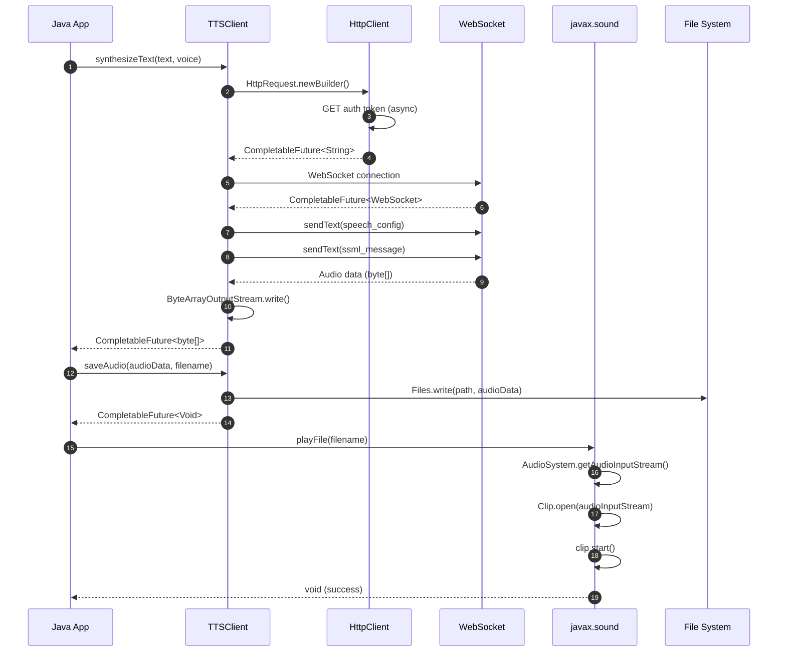

# Java TTS Implementation

This directory contains the Java implementation of the hello-edge-tts project using Java 21 LTS with modern HTTP client and CompletableFuture for async operations. This implementation showcases the latest Java features, reactive programming patterns, virtual threads, and enterprise-grade error handling.

## 🏗️ Java Implementation Architecture

The Java implementation uses CompletableFuture for reactive programming patterns:



## ✨ Features

- ✅ **CompletableFuture-based async TTS synthesis** with reactive programming
- ✅ **Modern Java 11+ HTTP client** with connection pooling and async support
- ✅ **Strong type safety** with Java's static typing and generics
- ✅ **Comprehensive exception handling** with custom exception hierarchy
- ✅ **SSML support** for advanced speech markup language
- ✅ **Voice filtering** with Java Streams API and functional programming
- ✅ **Batch processing** with parallel streams and concurrent execution
- ✅ **Configuration management** with Jackson JSON processing
- ✅ **Cross-platform audio playback** with javax.sound.sampled
- ✅ **Command-line interface** with argument parsing and Maven integration

## 📋 Prerequisites

- **Java**: 21+ LTS (Latest Long Term Support with modern features and performance improvements)
- **Build Tool**: Maven 3.9+ (Latest version recommended for Java 21 support)
- **Internet Connection**: Required for TTS service access
- **Audio System**: Speakers/headphones for audio playback
- **Optional**: IDE with Java 21 support (IntelliJ IDEA 2023.2+, Eclipse 2023-09+, VS Code with Extension Pack for Java)

## 🚀 Quick Start

```bash
# Navigate to Java directory
cd hello-edge-tts-java

# Compile project
mvn compile

# Run basic example
mvn exec:java -Dexec.mainClass="com.example.hellotts.HelloTTS"

# Try with custom text and voice
mvn exec:java -Dexec.mainClass="com.example.hellotts.HelloTTS" \
  -Dexec.args="--text 'Hello from Java!' --voice en-US-JennyNeural"

# Package as JAR
mvn package
java -jar target/hello-edge-tts-1.0-SNAPSHOT.jar --help
```

## 💡 Usage Examples

### Basic Text-to-Speech
```bash
# Simple synthesis with default voice
mvn exec:java -Dexec.mainClass="com.example.hellotts.HelloTTS" \
  -Dexec.args="--text 'Welcome to Java TTS!'"

# Use specific voice
mvn exec:java -Dexec.mainClass="com.example.hellotts.HelloTTS" \
  -Dexec.args="--text 'Hello World' --voice en-US-AriaNeural"

# Save to specific file
mvn exec:java -Dexec.mainClass="com.example.hellotts.HelloTTS" \
  -Dexec.args="--text 'Save me!' --output my_speech.mp3"
```

### Voice Discovery
```bash
# List all available voices
mvn exec:java -Dexec.mainClass="com.example.hellotts.HelloTTS" \
  -Dexec.args="--list-voices"

# Filter voices by language
mvn exec:java -Dexec.mainClass="com.example.hellotts.HelloTTS" \
  -Dexec.args="--language es"

# Find voices by gender
mvn exec:java -Dexec.mainClass="com.example.hellotts.HelloTTS" \
  -Dexec.args="--list-voices" | grep "Female"
```

### Advanced Features
```bash
# SSML synthesis
mvn exec:java -Dexec.mainClass="com.example.hellotts.HelloTTS" \
  -Dexec.args="--ssml '<speak>Hello <break time=\"1s\"/> World!</speak>'"

# Run with JAR
java -jar target/hello-edge-tts-1.0-SNAPSHOT.jar \
  --text "Enterprise ready!" --voice "en-US-DavisNeural"

# Batch processing example
mvn exec:java -Dexec.mainClass="com.example.hellotts.BatchExample"
```

## 📁 Project Structure

```
hello-edge-tts-java/
├── 📄 README.md              # This documentation
├── 📦 pom.xml                # Maven configuration and dependencies
├── 🎯 src/
│   ├── main/java/
│   │   └── com/example/hellotts/
│   │       ├── HelloTTS.java      # Main CLI application
│   │       ├── TTSClient.java     # TTS client implementation
│   │       ├── AudioPlayer.java   # Audio playback handling
│   │       ├── Voice.java         # Voice model
│   │       ├── TTSConfig.java     # Configuration management
│   │       └── SSMLUtils.java     # SSML utilities
│   ├── main/resources/
│   │   └── config.json            # Default configuration
│   └── test/java/
│       └── com/example/hellotts/
│           ├── TTSClientTest.java # Unit tests
│           └── IntegrationTest.java # Integration tests
└── 📂 target/                     # Build output directory
```

## 📦 Dependencies

| Dependency | Version | Purpose |
|------------|---------|---------|
| Java HTTP Client | Built-in (21+) | HTTP client with async support and virtual threads |
| Jackson | 2.16.1 | JSON processing with latest features |
| JUnit 5 | 5.10.1 | Modern testing framework |
| Maven Surefire | 3.2.5 | Test execution with Java 21 support |
| javax.sound.sampled | Built-in | Audio playback |

## 🔧 API Reference

### TTSClient
Main class for TTS operations with CompletableFuture-based async methods.

```java
public class TTSClient {
    public CompletableFuture<byte[]> synthesizeText(String text, String voice, boolean useSSML);
    public CompletableFuture<byte[]> synthesizeSSML(String ssml);
    public CompletableFuture<Void> saveAudio(byte[] audioData, String filename);
    public CompletableFuture<List<Voice>> listVoices();
    public CompletableFuture<List<Voice>> getVoicesByLanguage(String language);
}
```

### AudioPlayer
Handles audio playback functionality.

```java
public class AudioPlayer {
    public void playFile(String filename) throws AudioPlayerException;
    public void playAudioData(byte[] audioData, String formatHint) throws AudioPlayerException;
    public List<String> getAvailableBackends();
}
```

### Voice
Represents voice information and metadata.

```java
public class Voice {
    private final String name;
    private final String displayName;
    private final String locale;
    private final String gender;
    
    public String getLanguageCode();
    public String getCountryCode();
    public boolean matchesLanguage(String language);
}
```

## ⚡ Performance Characteristics

| Metric | Java Implementation | Comparison |
|--------|-------------------|------------|
| **Startup Time** | ~800ms | Slower startup (JVM warmup) |
| **Memory Usage** | ~85MB active | Higher due to JVM overhead |
| **Synthesis Speed** | Good | Excellent after JIT warmup |
| **Concurrent Performance** | Excellent | Mature threading model |
| **Development Speed** | Good | Enterprise tooling support |
| **Ecosystem** | Excellent | Vast enterprise ecosystem |

### Strengths
- 🏢 **Enterprise Ready**: Mature ecosystem and tooling
- 🔧 **JIT Optimization**: Performance improves over time
- 🧵 **Threading**: Excellent concurrent programming support
- 📊 **Monitoring**: Rich profiling and monitoring tools

### Best Use Cases
- 🏢 **Enterprise Applications**: Large-scale business systems
- 📱 **Android Development**: Native Android applications
- 🌐 **Web Services**: Spring Boot, microservices
- 🔄 **Integration**: System integration and middleware

---

## 🔗 Related Links

- 📖 [Main Project README](../README.md) - Complete project overview
- 🐍 [Python Implementation](../hello-edge-tts-python/README.md) - Rapid development alternative
- 🎯 [Dart Implementation](../hello-edge-tts-dart/README.md) - Cross-platform alternative
- 🦀 [Rust Implementation](../hello-edge-tts-rust/README.md) - High-performance alternative

## 📞 Support

For Java-specific issues:
1. Check the troubleshooting section above
2. Review the [main project documentation](../README.md)
3. Search existing GitHub issues
4. Create a new issue with the `java` label

**Happy coding with Java! ☕**
- ✅ Configuration management with Jackson JSON
- ✅ Cross-platform audio playback with javax.sound.sampled
- ✅ Command-line interface with argument parsing
- ✅ Maven-based build system with dependency management
- ✅ JUnit 5 testing framework integration

## Prerequisites

- Java 11 or higher (Java 17+ recommended for optimal performance)
- Maven 3.6 or higher (Maven 3.8+ recommended)
- Internet connection for TTS service access
- Audio playback capabilities (speakers/headphones)
- Optional: IDE with Java support (IntelliJ IDEA, Eclipse, VS Code)

## Quick Start

1. Navigate to the java directory:
```bash
cd java
```

2. Compile the project:
```bash
mvn compile
```

3. Run basic example:
```bash
mvn exec:java -Dexec.mainClass="com.example.hellotts.HelloTTS"
```

4. Package as JAR:
```bash
mvn package
java -jar target/hello-edge-tts-1.0-SNAPSHOT.jar
```

## Usage

### Basic Usage

Run the basic TTS example:
```bash
mvn exec:java -Dexec.mainClass="com.example.hellotts.HelloTTS"
```

This will convert "Hello, World!" to speech using the default voice and save it as an audio file.

### Advanced Usage

Run with custom text and voice:
```bash
mvn exec:java -Dexec.mainClass="com.example.hellotts.HelloTTS" -Dexec.args="--text 'Your custom text here' --voice en-US-JennyNeural"
```

### Available Options

- `--text`: Text to convert to speech
- `--voice`: Voice to use (default: en-US-AriaNeural)
- `--output`: Output filename (default: auto-generated)
- `--play`: Play audio after generation (default: true)
- `--list-voices`: List all available voices

## Examples

### List Available Voices
```bash
mvn exec:java -Dexec.mainClass="com.example.hellotts.HelloTTS" -Dexec.args="--list-voices"
```

### Generate Speech with Different Voice
```bash
mvn exec:java -Dexec.mainClass="com.example.hellotts.HelloTTS" -Dexec.args="--text 'Hello from Java!' --voice en-US-DavisNeural"
```

### Save to Specific File
```bash
mvn exec:java -Dexec.mainClass="com.example.hellotts.HelloTTS" -Dexec.args="--text 'Save me!' --output my_speech.mp3"
```

## Project Structure

```
java/
├── README.md
├── pom.xml                 # Maven configuration and dependencies
├── src/
│   ├── main/java/
│   │   └── com/example/hellotts/
│   │       ├── HelloTTS.java      # Main class and CLI
│   │       ├── TTSClient.java     # TTS client implementation
│   │       └── AudioPlayer.java   # Audio playback functionality
│   └── test/java/
│       └── com/example/hellotts/
│           └── TTSClientTest.java # Unit tests
```

## Dependencies

- Java 11+ HTTP Client: Built-in HTTP client
- Jackson: JSON processing
- JUnit 5: Testing framework
- Maven Surefire: Test execution
- javax.sound.sampled: Audio playback (built-in)

## Troubleshooting

### Common Issues

#### 1. Java and Maven Setup

**Java Version Issues**
```bash
# Check Java version
java -version
javac -version

# Check JAVA_HOME environment variable
echo $JAVA_HOME  # Unix/Linux/macOS
echo %JAVA_HOME% # Windows

# Set JAVA_HOME if needed
export JAVA_HOME=/path/to/java  # Unix/Linux/macOS
set JAVA_HOME=C:\path\to\java   # Windows
```

**Maven Configuration Issues**
```bash
# Check Maven version
mvn -version

# Update Maven if needed
# Download from: https://maven.apache.org/download.cgi

# Check Maven settings
mvn help:effective-settings

# Clear Maven cache if needed
mvn dependency:purge-local-repository
```

#### 2. Compilation and Build Issues

**Dependency Resolution Problems**
```bash
# Clean and rebuild
mvn clean compile

# Force update dependencies
mvn clean compile -U

# Resolve dependency conflicts
mvn dependency:tree
mvn dependency:analyze

# Skip tests if needed during development
mvn compile -DskipTests
```

**Compiler Errors**
```bash
# Compile with verbose output
mvn compile -X

# Check for encoding issues
mvn compile -Dfile.encoding=UTF-8

# Verify source/target compatibility
# Check pom.xml for maven.compiler.source and maven.compiler.target
```

#### 3. Runtime and Execution Issues

**ClassPath Issues**
```bash
# Run with explicit classpath
java -cp "target/classes:target/dependency/*" com.example.hellotts.HelloTTS

# Use Maven exec plugin with dependencies
mvn exec:java -Dexec.mainClass="com.example.hellotts.HelloTTS" -Dexec.includeProjectDependencies=true
```

**Memory Issues**
```bash
# Increase heap size
export MAVEN_OPTS="-Xmx2g -Xms512m"
mvn exec:java -Dexec.mainClass="com.example.hellotts.HelloTTS"

# Or run JAR with memory settings
java -Xmx2g -Xms512m -jar target/hello-edge-tts-1.0-SNAPSHOT.jar
```

#### 4. Audio System Issues

**Audio Playback Problems**

**Windows:**
```bash
# Check Windows audio services
services.msc
# Ensure "Windows Audio" service is running

# Update audio drivers
# Device Manager > Sound, video and game controllers
```

**macOS:**
```bash
# Check audio permissions
# System Preferences > Security & Privacy > Privacy > Microphone

# Reset audio system
sudo killall coreaudiod
```

**Linux:**
```bash
# Install audio libraries
sudo apt-get install libasound2-dev  # Ubuntu/Debian
sudo dnf install alsa-lib-devel      # Fedora

# Check audio system
aplay -l  # List audio devices
pulseaudio --check -v  # Check PulseAudio

# Add user to audio group
sudo usermod -a -G audio $USER
# Log out and back in
```

#### 5. Network and HTTP Issues

**Connection Problems**
```bash
# Test network connectivity
ping microsoft.com
curl -I https://speech.platform.bing.com

# Check proxy settings
# Add to JVM arguments:
-Dhttp.proxyHost=proxy.company.com -Dhttp.proxyPort=8080
-Dhttps.proxyHost=proxy.company.com -Dhttps.proxyPort=8080
```

**SSL/TLS Certificate Issues**
```bash
# Update Java certificates
# Download latest cacerts from Oracle

# Trust specific certificate (if needed)
keytool -import -alias microsoft -file microsoft.crt -keystore $JAVA_HOME/lib/security/cacerts

# Disable SSL verification (NOT recommended for production)
-Dcom.sun.net.ssl.checkRevocation=false
```

### Error Messages and Solutions

| Error Message | Cause | Solution |
|---------------|-------|----------|
| `Unsupported class file major version` | Java version mismatch | Update Java to version 11+ |
| `Audio device not found` | Audio system issue | Check system audio configuration |
| `Connection timeout` | Network issue | Check internet connection and firewall |
| `Invalid voice name` | Wrong voice identifier | Use `--list-voices` to see available options |
| `ClassNotFoundException` | Missing dependency | Run `mvn dependency:copy-dependencies` |
| `OutOfMemoryError` | Insufficient heap space | Increase JVM heap size with `-Xmx` |
| `ConnectException` | Network connectivity | Check internet connection and proxy settings |
| `SSLHandshakeException` | SSL certificate issue | Update Java certificates or check proxy |
| `IllegalArgumentException` | Invalid parameter | Check method parameters and documentation |
| `CompletionException` | Async operation failed | Check wrapped exception cause |

### Performance Issues

**Slow HTTP Requests**
```java
// Configure HTTP client timeout
HttpClient client = HttpClient.newBuilder()
    .connectTimeout(Duration.ofSeconds(30))
    .build();

// Configure request timeout
HttpRequest request = HttpRequest.newBuilder()
    .uri(URI.create(url))
    .timeout(Duration.ofSeconds(60))
    .build();
```

**Memory Usage Optimization**
```bash
# JVM tuning for better performance
-XX:+UseG1GC
-XX:MaxGCPauseMillis=200
-XX:+UseStringDeduplication

# Monitor memory usage
-XX:+PrintGCDetails
-XX:+PrintGCTimeStamps
```

### Platform-Specific Issues

#### Windows
```bash
# Path separator issues
# Use File.separator or Paths.get() instead of hardcoded separators

# Audio driver issues
# Update DirectX and audio drivers
# Check Windows Media Feature Pack installation
```

#### macOS
```bash
# Gatekeeper issues
xattr -d com.apple.quarantine target/hello-edge-tts-1.0-SNAPSHOT.jar

# Audio permissions
# System Preferences > Security & Privacy > Privacy > Microphone
```

#### Linux
```bash
# Audio group permissions
groups $USER  # Check if user is in audio group
sudo usermod -a -G audio $USER

# PulseAudio configuration
# Check ~/.pulse/client.conf
# autospawn = yes
```

### Development and Debugging

**IDE Configuration**

**IntelliJ IDEA:**
```bash
# Import as Maven project
# File > Open > Select pom.xml
# Enable annotation processing
# Settings > Build > Compiler > Annotation Processors
```

**Eclipse:**
```bash
# Import Maven project
# File > Import > Existing Maven Projects
# Right-click project > Maven > Reload Projects
```

**VS Code:**
```bash
# Install Java Extension Pack
# Open java directory
# Use integrated terminal for Maven commands
```

**Debugging**
```bash
# Enable debug logging
-Djava.util.logging.config.file=logging.properties

# Remote debugging
-agentlib:jdwp=transport=dt_socket,server=y,suspend=n,address=5005

# JVM monitoring
-Dcom.sun.management.jmxremote
-Dcom.sun.management.jmxremote.port=9999
-Dcom.sun.management.jmxremote.authenticate=false
-Dcom.sun.management.jmxremote.ssl=false
```

### Testing Issues

**JUnit Test Failures**
```bash
# Run tests with verbose output
mvn test -Dtest=TTSClientTest

# Run single test method
mvn test -Dtest=TTSClientTest#testSynthesizeText

# Skip tests during build
mvn package -DskipTests

# Generate test reports
mvn surefire-report:report
```

### Getting Help

1. **Check logs**: Enable verbose logging with system properties
2. **Test with minimal example**: Use basic HelloTTS.java first
3. **Verify dependencies**: Run `mvn dependency:tree` to check versions
4. **Check system requirements**: Ensure Java version compatibility
5. **Test network connectivity**: Verify access to Microsoft services
6. **Use profiling tools**: JProfiler, VisualVM for performance analysis

## Advanced Usage and Examples

### 1. Basic Library Usage

```java
package com.example.hellotts;

import java.util.concurrent.CompletableFuture;
import java.util.concurrent.ExecutionException;

public class BasicExample {
    public static void main(String[] args) {
        try {
            // Create TTS client
            EdgeTtsProcessor client = new EdgeTtsProcessor();

            // Synthesize text asynchronously
            CompletableFuture<byte[]> audioFuture = client.synthesizeText(
                    "Hello from Java!",
                    "en-US-AriaNeural"
            );

            // Get the result
            byte[] audioData = audioFuture.get();

            // Save to file
            client.saveAudio(audioData, "hello.mp3").get();

            // Play audio
            AudioPlayer player = new AudioPlayer();
            player.playFile("hello.mp3");

            System.out.println("TTS synthesis completed successfully!");

        } catch (ExecutionException | InterruptedException e) {
            System.err.println("Error: " + e.getMessage());
            e.printStackTrace();
        }
    }
}
```

### 2. Voice Discovery and Management

```java
package com.example.hellotts;

import java.util.List;
import java.util.Map;
import java.util.concurrent.CompletableFuture;
import java.util.stream.Collectors;

public class VoiceDiscoveryExample {
    public static void main(String[] args) {
        try {
            EdgeTtsProcessor client = new EdgeTtsProcessor();

            // Get all available voices
            CompletableFuture<List<Voice>> allVoicesFuture = client.listVoices();
            List<Voice> allVoices = allVoicesFuture.get();

            System.out.println("Total voices available: " + allVoices.size());

            // Filter voices by language using streams
            List<Voice> englishVoices = allVoices.stream()
                    .filter(voice -> voice.getLocale().startsWith("en"))
                    .collect(Collectors.toList());

            System.out.println("English voices: " + englishVoices.size());

            // Group voices by gender
            Map<String, List<Voice>> voicesByGender = englishVoices.stream()
                    .collect(Collectors.groupingBy(Voice::getGender));

            voicesByGender.forEach((gender, voices) ->
                    System.out.println(gender + " voices: " + voices.size())
            );

            // Test different voices concurrently
            List<CompletableFuture<String>> voiceTests = englishVoices.stream()
                    .limit(3)
                    .map(voice -> testVoice(client, voice))
                    .collect(Collectors.toList());

            // Wait for all voice tests to complete
            CompletableFuture<Void> allTests = CompletableFuture.allOf(
                    voiceTests.toArray(new CompletableFuture[0])
            );

            allTests.get();

            // Collect results
            for (CompletableFuture<String> test : voiceTests) {
                System.out.println(test.get());
            }

        } catch (Exception e) {
            System.err.println("Voice discovery error: " + e.getMessage());
            e.printStackTrace();
        }
    }

    private static CompletableFuture<String> testVoice(EdgeTtsProcessor client, Voice voice) {
        return CompletableFuture.supplyAsync(() -> {
            try {
                System.out.println("Testing voice: " + voice.getDisplayName());

                String text = "Hello, I am " + voice.getDisplayName();
                byte[] audioData = client.synthesizeText(text, voice.getName()).get();

                String filename = "voice_" + voice.getName().replace("-", "_") + ".mp3";
                client.saveAudio(audioData, filename).get();

                return "Saved: " + filename;
            } catch (Exception e) {
                return "Error testing " + voice.getName() + ": " + e.getMessage();
            }
        });
    }
}
```

### 3. SSML Support

```java
package com.example.hellotts;

import java.util.concurrent.CompletableFuture;

public class SSMLExample {
    public static void main(String[] args) {
        try {
            EdgeTtsProcessor client = new EdgeTtsProcessor();
            String voice = "en-US-AriaNeural";

            // SSML with prosody controls
            String ssmlWithProsody = String.format("""
                    <speak version="1.0" xmlns="http://www.w3.org/2001/10/synthesis" xml:lang="en-US">
                        <voice name="%s">
                            This is <prosody rate="slow">slow speech</prosody> and 
                            this is <prosody rate="fast">fast speech</prosody>.
                            <break time="1s"/>
                            Now with <prosody pitch="high">high pitch</prosody> and 
                            <prosody pitch="low">low pitch</prosody>.
                        </voice>
                    </speak>
                    """, voice);

            CompletableFuture<byte[]> prosodyAudio = client.synthesizeSSML(ssmlWithProsody);
            client.saveAudio(prosodyAudio.get(), "ssml_prosody.mp3").get();

            // SSML with emphasis and breaks
            String ssmlWithEmphasis = String.format("""
                    <speak version="1.0" xmlns="http://www.w3.org/2001/10/synthesis" xml:lang="en-US">
                        <voice name="%s">
                            This is <emphasis level="strong">very important</emphasis>.
                            <break time="2s"/>
                            And this comes after a pause.
                        </voice>
                    </speak>
                    """, voice);

            CompletableFuture<byte[]> emphasisAudio = client.synthesizeSSML(ssmlWithEmphasis);
            client.saveAudio(emphasisAudio.get(), "ssml_emphasis.mp3").get();

            // Using SSMLBuilder for complex markup
            SSMLBuilder builder = new SSMLBuilder(voice)
                    .addText("Welcome to our ")
                    .addEmphasis("amazing", "strong")
                    .addText(" TTS demonstration. ")
                    .addBreak("500ms")
                    .addProsody("This part is slow and low.", "slow", "low", null)
                    .addBreak("1s")
                    .addProsody("And this is fast and high!", "fast", "high", null);

            String complexSSML = builder.build();
            CompletableFuture<byte[]> complexAudio = client.synthesizeSSML(complexSSML);
            client.saveAudio(complexAudio.get(), "ssml_complex.mp3").get();

            System.out.println("SSML examples generated successfully!");

        } catch (Exception e) {
            System.err.println("SSML synthesis error: " + e.getMessage());
            e.printStackTrace();
        }
    }
}
```

### 4. Batch Processing with CompletableFuture

```java
package com.example.hellotts;

import java.util.Arrays;
import java.util.List;
import java.util.concurrent.CompletableFuture;
import java.util.concurrent.ExecutorService;
import java.util.concurrent.Executors;
import java.util.stream.IntStream;

public class BatchProcessingExample {
    public static void main(String[] args) {
        ExecutorService executor = Executors.newFixedThreadPool(4);

        try {
            EdgeTtsProcessor client = new EdgeTtsProcessor();
            String voice = "en-US-AriaNeural";

            List<String> texts = Arrays.asList(
                    "First sentence to synthesize.",
                    "Second sentence with different content.",
                    "Third sentence for batch processing demo.",
                    "Fourth sentence to complete the batch."
            );

            // Process all texts concurrently
            List<CompletableFuture<String>> futures = IntStream.range(0, texts.size())
                    .mapToObj(i -> processTextAsync(client, texts.get(i), voice, i + 1, executor))
                    .toList();

            // Wait for all to complete
            CompletableFuture<Void> allFutures = CompletableFuture.allOf(
                    futures.toArray(new CompletableFuture[0])
            );

            allFutures.get();

            // Report results
            for (CompletableFuture<String> future : futures) {
                System.out.println(future.get());
            }

            System.out.println("Batch processing completed!");

        } catch (Exception e) {
            System.err.println("Batch processing error: " + e.getMessage());
            e.printStackTrace();
        } finally {
            executor.shutdown();
        }
    }

    private static CompletableFuture<String> processTextAsync(
            EdgeTtsProcessor client, String text, String voice, int index, ExecutorService executor) {

        return CompletableFuture.supplyAsync(() -> {
            try {
                byte[] audioData = client.synthesizeText(text, voice).get();
                String filename = "batch_" + index + ".mp3";
                client.saveAudio(audioData, filename).get();
                return "Success: " + filename;
            } catch (Exception e) {
                return "Error processing text " + index + ": " + e.getMessage();
            }
        }, executor);
    }
}
```

### 5. Configuration Management

```java
package com.example.hellotts;

import com.fasterxml.jackson.databind.ObjectMapper;

import java.io.File;

public class ConfigurationExample {

    public static class TTSConfiguration {
        private String defaultVoice = "en-US-AriaNeural";
        private String outputFormat = "mp3";
        private String outputDirectory = "./output";
        private boolean autoPlay = true;
        private boolean cacheVoices = true;
        private int maxRetries = 3;
        private int timeoutSeconds = 30;

        // Getters and setters
        public String getDefaultVoice() {
            return defaultVoice;
        }

        public void setDefaultVoice(String defaultVoice) {
            this.defaultVoice = defaultVoice;
        }

        public String getOutputFormat() {
            return outputFormat;
        }

        public void setOutputFormat(String outputFormat) {
            this.outputFormat = outputFormat;
        }

        public String getOutputDirectory() {
            return outputDirectory;
        }

        public void setOutputDirectory(String outputDirectory) {
            this.outputDirectory = outputDirectory;
        }

        public boolean isAutoPlay() {
            return autoPlay;
        }

        public void setAutoPlay(boolean autoPlay) {
            this.autoPlay = autoPlay;
        }

        public boolean isCacheVoices() {
            return cacheVoices;
        }

        public void setCacheVoices(boolean cacheVoices) {
            this.cacheVoices = cacheVoices;
        }

        public int getMaxRetries() {
            return maxRetries;
        }

        public void setMaxRetries(int maxRetries) {
            this.maxRetries = maxRetries;
        }

        public int getTimeoutSeconds() {
            return timeoutSeconds;
        }

        public void setTimeoutSeconds(int timeoutSeconds) {
            this.timeoutSeconds = timeoutSeconds;
        }
    }

    public static void main(String[] args) {
        try {
            // Create custom configuration
            TTSConfiguration config = new TTSConfiguration();
            config.setDefaultVoice("en-US-JennyNeural");
            config.setOutputFormat("wav");
            config.setOutputDirectory("./custom_output");
            config.setAutoPlay(false);

            // Use configuration with client
            EdgeTtsProcessor client = new EdgeTtsProcessor(config);

            // Configuration is automatically applied
            byte[] audioData = client.synthesizeText("Configured TTS example", "").get();
            client.saveAudio(audioData, "configured.wav").get();

            // Save configuration to file
            ObjectMapper mapper = new ObjectMapper();
            mapper.writeValue(new File("tts_config.json"), config);

            // Load configuration from file
            TTSConfiguration loadedConfig = mapper.readValue(
                    new File("tts_config.json"),
                    TTSConfiguration.class
            );

            EdgeTtsProcessor clientFromConfig = new EdgeTtsProcessor(loadedConfig);

            System.out.println("Configuration example completed!");
            System.out.println("Loaded config - Default voice: " + loadedConfig.getDefaultVoice());

        } catch (Exception e) {
            System.err.println("Configuration error: " + e.getMessage());
            e.printStackTrace();
        }
    }
}
```

### 6. Multi-language Support

```java
package com.example.hellotts;

import java.util.Arrays;
import java.util.List;
import java.util.concurrent.CompletableFuture;

public class MultilingualExample {

    private static class LanguageSample {
        private final String text;
        private final String voice;

        public LanguageSample(String text, String voice) {
            this.text = text;
            this.voice = voice;
        }

        public String getText() {
            return text;
        }

        public String getVoice() {
            return voice;
        }
    }

    public static void main(String[] args) {
        try {
            EdgeTtsProcessor client = new EdgeTtsProcessor();

            // Language samples with appropriate voices
            List<LanguageSample> samples = Arrays.asList(
                    new LanguageSample("Hello, how are you today?", "en-US-AriaNeural"),
                    new LanguageSample("Hola, ¿cómo estás hoy?", "es-ES-ElviraNeural"),
                    new LanguageSample("Bonjour, comment allez-vous aujourd'hui?", "fr-FR-DeniseNeural"),
                    new LanguageSample("Hallo, wie geht es dir heute?", "de-DE-KatjaNeural"),
                    new LanguageSample("こんにちは、今日はいかがですか？", "ja-JP-NanamiNeural")
            );

            for (int i = 0; i < samples.size(); i++) {
                LanguageSample sample = samples.get(i);

                try {
                    System.out.println("Synthesizing: " +
                            sample.getText().substring(0, Math.min(30, sample.getText().length())) + "...");

                    CompletableFuture<byte[]> audioFuture = client.synthesizeText(
                            sample.getText(),
                            sample.getVoice()
                    );

                    byte[] audioData = audioFuture.get();

                    // Extract language code from voice name
                    String langCode = sample.getVoice().split("-")[0];
                    String filename = String.format("multilingual_%s_%d.mp3", langCode, i + 1);

                    client.saveAudio(audioData, filename).get();
                    System.out.println("Saved: " + filename);

                } catch (Exception e) {
                    System.err.println("Error with " + sample.getVoice() + ": " + e.getMessage());
                }
            }

            System.out.println("Multi-language example completed!");

        } catch (Exception e) {
            System.err.println("Multi-language error: " + e.getMessage());
            e.printStackTrace();
        }
    }
}
```

### 7. Error Handling and Resilience

```java
package com.example.hellotts;

import java.time.Duration;
import java.util.Arrays;
import java.util.List;
import java.util.concurrent.CompletableFuture;
import java.util.concurrent.TimeUnit;
import java.util.concurrent.TimeoutException;
import java.util.logging.Logger;

public class RobustTTSExample {
    private static final Logger logger = Logger.getLogger(RobustTTSExample.class.getName());

    private static class TestCase {
        private final String text;
        private final String voice;
        private final String filename;

        public TestCase(String text, String voice, String filename) {
            this.text = text;
            this.voice = voice;
            this.filename = filename;
        }

        public String getText() {
            return text;
        }

        public String getVoice() {
            return voice;
        }

        public String getFilename() {
            return filename;
        }
    }

    public static void main(String[] args) {
        EdgeTtsProcessor client = new EdgeTtsProcessor();
        AudioPlayer player = new AudioPlayer();

        // Test cases with potential issues
        List<TestCase> testCases = Arrays.asList(
                new TestCase("Valid text", "en-US-AriaNeural", "valid.mp3"),
                new TestCase("Valid text", "invalid-voice-name", "invalid_voice.mp3"),
                new TestCase("", "en-US-AriaNeural", "empty_text.mp3"), // Empty text
                new TestCase("Very long text ".repeat(1000), "en-US-AriaNeural", "long_text.mp3") // Very long
        );

        for (TestCase testCase : testCases) {
            logger.info("Processing: " + testCase.getFilename());

            try {
                // Synthesize with timeout and retry logic
                CompletableFuture<byte[]> audioFuture = retryWithBackoff(
                        () -> client.synthesizeText(testCase.getText(), testCase.getVoice()),
                        3,
                        Duration.ofSeconds(1)
                );

                byte[] audioData = audioFuture.get(30, TimeUnit.SECONDS);

                // Save with error handling
                client.saveAudio(audioData, testCase.getFilename()).get();

                // Play with fallback
                try {
                    player.playFile(testCase.getFilename());
                    logger.info("Successfully played: " + testCase.getFilename());
                } catch (AudioException ae) {
                    logger.warning("Playback failed for " + testCase.getFilename() + ": " + ae.getMessage());

                    // Try alternative playback method
                    try {
                        player.playAudioData(audioData, "mp3");
                    } catch (AudioException e) {
                        logger.severe("All playback methods failed for " + testCase.getFilename());
                    }
                }

                logger.info("Successfully processed: " + testCase.getFilename());

            } catch (TimeoutException e) {
                logger.severe("Timeout processing " + testCase.getFilename());
            } catch (TTSException te) {
                logger.severe("TTS error for " + testCase.getFilename() + ": " + te.getMessage());
            } catch (Exception e) {
                logger.severe("Unexpected error for " + testCase.getFilename() + ": " + e.getMessage());
            }
        }
    }

    // Retry helper with exponential backoff
    private static <T> CompletableFuture<T> retryWithBackoff(
            java.util.function.Supplier<CompletableFuture<T>> operation,
            int maxRetries,
            Duration initialDelay) {

        return operation.get().handle((result, throwable) -> {
            if (throwable == null) {
                return CompletableFuture.completedFuture(result);
            }

            if (maxRetries <= 1) {
                CompletableFuture<T> failed = new CompletableFuture<>();
                failed.completeExceptionally(throwable);
                return failed;
            }

            logger.warning("Attempt failed: " + throwable.getMessage() +
                    ", retrying in " + initialDelay.toMillis() + "ms");

            return CompletableFuture
                    .delayedExecutor(initialDelay.toMillis(), TimeUnit.MILLISECONDS)
                    .execute(() -> {
                    })
                    .thenCompose(v -> retryWithBackoff(operation, maxRetries - 1, initialDelay.multipliedBy(2)));
        }).thenCompose(future -> future);
    }
}
```

### 8. Performance Optimization and Benchmarking

```java
package com.example.hellotts;

import java.time.Duration;
import java.time.Instant;
import java.util.List;
import java.util.concurrent.CompletableFuture;
import java.util.concurrent.ExecutorService;
import java.util.concurrent.Executors;
import java.util.stream.IntStream;

public class PerformanceExample {
    public static void main(String[] args) {
        ExecutorService executor = Executors.newFixedThreadPool(
                Runtime.getRuntime().availableProcessors()
        );

        try {
            EdgeTtsProcessor client = new EdgeTtsProcessor();

            // Measure synthesis time
            Instant start = Instant.now();

            String text = "This is a performance test of the TTS system.";
            String voice = "en-US-AriaNeural";

            // Single synthesis
            CompletableFuture<byte[]> audioFuture = client.synthesizeText(text, voice);
            byte[] audioData = audioFuture.get();
            Duration synthesisTime = Duration.between(start, Instant.now());

            System.out.println("Synthesis time: " + synthesisTime.toMillis() + "ms");
            System.out.println("Audio size: " + audioData.length + " bytes");
            System.out.println("Throughput: " +
                    String.format("%.2f", (double) audioData.length / synthesisTime.toMillis()) +
                    " bytes/ms");

            // Concurrent processing benchmark
            List<String> texts = IntStream.rangeClosed(1, 10)
                    .mapToObj(i -> "Performance test number " + i)
                    .toList();

            start = Instant.now();

            // Process concurrently
            List<CompletableFuture<byte[]>> futures = texts.stream()
                    .map(t -> client.synthesizeText(t, voice))
                    .toList();

            CompletableFuture<Void> allFutures = CompletableFuture.allOf(
                    futures.toArray(new CompletableFuture[0])
            );

            allFutures.get();
            Duration concurrentTime = Duration.between(start, Instant.now());

            // Calculate results
            int successfulResults = 0;
            long totalBytes = 0;

            for (CompletableFuture<byte[]> future : futures) {
                try {
                    byte[] result = future.get();
                    successfulResults++;
                    totalBytes += result.length;
                } catch (Exception e) {
                    System.err.println("Future failed: " + e.getMessage());
                }
            }

            System.out.println("Concurrent processing time: " + concurrentTime.toMillis() + "ms");
            System.out.println("Successful syntheses: " + successfulResults + "/" + texts.size());
            System.out.println("Total audio data: " + totalBytes + " bytes");
            System.out.println("Concurrent throughput: " +
                    String.format("%.2f", (double) totalBytes / concurrentTime.toMillis()) +
                    " bytes/ms");

            // Voice caching benchmark
            System.out.println("\nTesting voice caching...");

            // First call (cache miss)
            start = Instant.now();
            List<Voice> voices = client.listVoices().get();
            Duration firstCallTime = Duration.between(start, Instant.now());

            // Second call (cache hit)
            start = Instant.now();
            List<Voice> voicesCached = client.listVoices().get();
            Duration secondCallTime = Duration.between(start, Instant.now());

            System.out.println("First voice list call: " + firstCallTime.toMillis() + "ms");
            System.out.println("Cached voice list call: " + secondCallTime.toMillis() + "ms");

            if (secondCallTime.toMillis() > 0) {
                double speedup = (double) firstCallTime.toMillis() / secondCallTime.toMillis();
                System.out.println("Cache speedup: " + String.format("%.1fx", speedup));
            }

            System.out.println("Found " + voices.size() + " voices total");

        } catch (Exception e) {
            System.err.println("Performance test error: " + e.getMessage());
            e.printStackTrace();
        } finally {
            executor.shutdown();
        }
    }
}
```

## API Reference

### TTSClient
Main class for TTS operations with CompletableFuture-based async methods.

```java
public class TTSClient {
    public TTSClient();
    public TTSClient(TTSConfiguration config);
    
    public CompletableFuture<byte[]> synthesizeText(String text, String voice);
    public CompletableFuture<byte[]> synthesizeSSML(String ssml);
    public CompletableFuture<Void> saveAudio(byte[] audioData, String filename);
    public CompletableFuture<List<Voice>> listVoices();
    public CompletableFuture<List<Voice>> getVoicesByLanguage(String language);
}
```

### AudioPlayer
Handles audio playback functionality using javax.sound.sampled.

```java
public class AudioPlayer {
    public AudioPlayer();
    
    public void playFile(String filename) throws AudioException;
    public void playAudioData(byte[] audioData, String formatHint) throws AudioException;
    public List<String> getAvailableBackends();
}
```

### Voice
Immutable class representing voice information and metadata.

```java
public final class Voice {
    private final String name;
    private final String displayName;
    private final String locale;
    private final String gender;
    
    public Voice(String name, String displayName, String locale, String gender);
    
    public String getName();
    public String getDisplayName();
    public String getLocale();
    public String getGender();
    
    @Override
    public boolean equals(Object obj);
    @Override
    public int hashCode();
    @Override
    public String toString();
}
```

### TTSException
Custom exception class for TTS-related errors.

```java
public class TTSException extends Exception {
    public TTSException(String message);
    public TTSException(String message, Throwable cause);
    public TTSException(Throwable cause);
}
```

For detailed API documentation, generate Javadoc:
```bash
mvn javadoc:javadoc
open target/site/apidocs/index.html
```

## Building and Testing

### Development Build
```bash
mvn compile
```

### Run Tests
```bash
mvn test
```

### Package JAR with Dependencies
```bash
mvn package
mvn assembly:single  # Creates JAR with dependencies
```

### Clean Build
```bash
mvn clean compile
```

### Generate Reports
```bash
mvn site  # Generate project reports
mvn surefire-report:report  # Test reports
mvn jacoco:report  # Code coverage
```

### Code Quality
```bash
mvn checkstyle:check  # Code style
mvn spotbugs:check    # Bug detection
mvn pmd:check         # Code analysis
```

## IDE Integration

### IntelliJ IDEA
1. **Import Project**: File → Open → Select `pom.xml`
2. **Configure JDK**: File → Project Structure → Project → Project SDK
3. **Enable Annotation Processing**: Settings → Build → Compiler → Annotation Processors
4. **Run Configuration**: Run → Edit Configurations → Add Application

### Eclipse
1. **Import Maven Project**: File → Import → Existing Maven Projects
2. **Configure Build Path**: Right-click project → Properties → Java Build Path
3. **Maven Integration**: Right-click project → Maven → Reload Projects
4. **Run Configuration**: Run → Run Configurations → Java Application

### VS Code
1. **Install Extensions**: Java Extension Pack, Maven for Java
2. **Open Project**: File → Open Folder → Select java directory
3. **Configure Settings**: .vscode/settings.json for Java path
4. **Debug Configuration**: .vscode/launch.json for run/debug settings