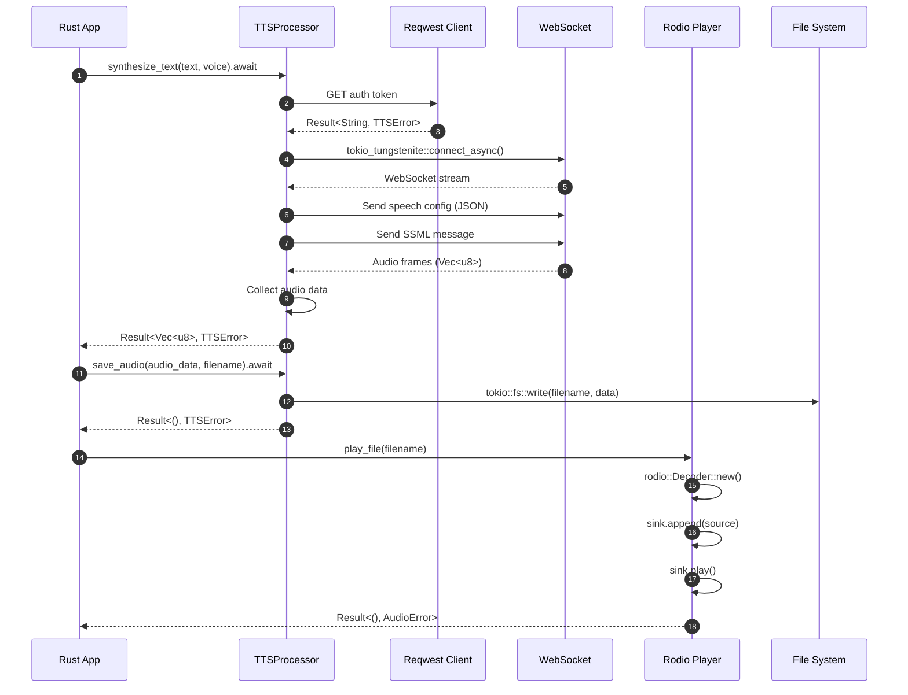

# Rust TTS Implementation

This directory contains the Rust implementation of the hello-edge-tts project using `reqwest` and `tokio` for async HTTP communication. This implementation showcases Rust's memory safety, performance, and robust error handling with the Result type system.

## 🏗️ Rust Implementation Architecture

The Rust implementation leverages tokio async runtime with zero-cost abstractions:



## ✨ Features

- ✅ **Async/await TTS synthesis** with tokio runtime and zero-cost abstractions
- ✅ **Memory-safe HTTP client** using reqwest with connection pooling
- ✅ **Strong type safety** with Rust's ownership system and compile-time checks
- ✅ **Comprehensive error handling** with Result<T, E> and custom error types
- ✅ **SSML support** for advanced speech markup language
- ✅ **Voice filtering and management** with efficient iterators
- ✅ **Batch processing** with concurrent futures and parallel execution
- ✅ **Configuration management** with serde serialization
- ✅ **Cross-platform audio playback** with rodio audio library
- ✅ **Command-line interface** with clap argument parsing

## 📋 Prerequisites

- **Rust**: 1.60+ (Rust 1.70+ recommended for latest features)
- **Package Manager**: Cargo (included with Rust)
- **Build Tools**: Platform-specific build essentials
- **Internet Connection**: Required for TTS service access
- **Audio System**: Speakers/headphones for audio playback
- **System Libraries**: Platform-specific audio libraries (ALSA, PulseAudio, etc.)

## 🚀 Quick Start

```bash
# Navigate to Rust directory
cd hello-edge-tts-rust

# Build project
cargo build

# Run basic example
cargo run

# Try with custom text and voice
cargo run -- --text "Hello from Rust!" --voice "en-US-JennyNeural"

# Build optimized release version
cargo build --release
./target/release/hello-edge-tts --help
```

## 💡 Usage Examples

### Basic Text-to-Speech

```bash
# Simple synthesis with default voice
cargo run -- --text "Welcome to Rust TTS!"

# Use specific voice
cargo run -- --text "Hello World" --voice "en-US-AriaNeural"

# Save to specific file
cargo run -- --text "Save me!" --output "my_speech.mp3"
```

### Voice Discovery

```bash
# List all available voices
cargo run -- --list-voices

# Filter voices by language
cargo run -- --language "es"

# Find voices by gender
cargo run -- --list-voices | grep "Female"
```

### Advanced Features

```bash
# SSML synthesis
cargo run -- --ssml '<speak>Hello <break time="1s"/> World!</speak>'

# Run example
cargo run --example hello_tts

# Release build usage
./target/release/hello-edge-tts --text "High performance!" --voice "en-US-DavisNeural"
```

## 📁 Project Structure

```
hello-edge-tts-rust/
├── 📄 README.md              # This documentation
├── 📦 Cargo.toml             # Dependencies and project configuration
├── 🎯 src/
│   ├── main.rs               # CLI application entry point
│   ├── tts_client.rs         # TTS client implementation
│   ├── audio_player.rs       # Audio playback handling
│   ├── config_manager.rs     # Configuration management
│   ├── voice.rs              # Voice model and utilities
│   └── lib.rs                # Library exports
├── 📚 examples/
│   └── hello_tts.rs          # Complete usage example with all features
└── 🧪 tests/
    ├── integration_test.rs   # Integration tests
    └── unit_tests.rs         # Unit tests
```

## 📦 Dependencies

| Crate        | Version | Purpose                        |
| ------------ | ------- | ------------------------------ |
| `reqwest`    | 0.11    | HTTP client with async support |
| `tokio`      | 1.0     | Async runtime                  |
| `serde`      | 1.0     | Serialization/deserialization  |
| `serde_json` | 1.0     | JSON handling                  |
| `clap`       | 4.0     | Command-line argument parsing  |
| `rodio`      | 0.17    | Audio playback                 |
| `anyhow`     | 1.0     | Error handling                 |
| `thiserror`  | 1.0     | Custom error types             |

## 🔧 API Reference

### TTSProcessor

Main struct for TTS operations with async methods returning `Result<T, TTSError>`.

```rust
impl TTSProcessor {
    pub fn new(config: Option<TTSConfig>) -> Result<Self, TTSError>;
    pub async fn synthesize_text(&self, text: &str, voice: &str, use_ssml: bool) -> Result<Vec<u8>, TTSError>;
    pub async fn synthesize_ssml(&self, ssml: &str) -> Result<Vec<u8>, TTSError>;
    pub async fn save_audio(&self, audio_data: &[u8], filename: &str) -> Result<(), TTSError>;
    pub async fn list_voices(&self) -> Result<Vec<Voice>, TTSError>;
    pub async fn get_voices_by_language(&self, language: &str) -> Result<Vec<Voice>, TTSError>;
}
```

### AudioPlayer

Handles audio playback functionality.

```rust
impl AudioPlayer {
    pub fn new() -> Self;
    pub fn play_file(&self, filename: &str) -> Result<(), AudioError>;
    pub fn play_audio_data(&self, audio_data: &[u8], format_hint: &str) -> Result<(), AudioError>;
    pub fn get_available_backends(&self) -> Vec<String>;
}
```

### Voice

Represents voice information and metadata.

```rust
#[derive(Debug, Clone, Serialize, Deserialize)]
pub struct Voice {
    pub name: String,
    pub display_name: String,
    pub locale: String,
    pub gender: String,
}

impl Voice {
    pub fn language_code(&self) -> &str;
    pub fn country_code(&self) -> Option<&str>;
    pub fn matches_language(&self, language: &str) -> bool;
}
```

## ⚡ Performance Characteristics

| Metric                     | Rust Implementation | Comparison                   |
| -------------------------- | ------------------- | ---------------------------- |
| **Startup Time**           | ~20ms               | Fastest startup              |
| **Memory Usage**           | ~12MB active        | Lowest memory footprint      |
| **Synthesis Speed**        | Excellent           | Highest performance          |
| **Concurrent Performance** | Excellent           | Zero-cost async abstractions |
| **Development Speed**      | Good                | Learning curve but powerful  |
| **Safety**                 | Excellent           | Memory safety without GC     |

### Strengths

- 🚀 **Zero-Cost Abstractions**: High-level code, low-level performance
- 🛡️ **Memory Safety**: No segfaults or memory leaks
- ⚡ **Performance**: Comparable to C/C++
- 🔄 **Concurrency**: Fearless concurrency with ownership

### Best Use Cases

- 🎮 **High-Performance Apps**: Games, real-time systems
- 🔧 **System Programming**: OS components, drivers
- 🌐 **Web Services**: High-throughput web servers
- 📊 **Data Processing**: Large-scale data analysis

---

## 🔗 Related Links

- 📖 [Main Project README](../README.md) - Complete project overview
- 🐍 [Python Implementation](../hello-edge-tts-python/README.md) - Rapid development alternative
- 🎯 [Dart Implementation](../hello-edge-tts-dart/README.md) - Cross-platform alternative
- ☕ [Java Implementation](../hello-edge-tts-java/README.md) - Enterprise alternative

## 📞 Support

For Rust-specific issues:

1. Check the troubleshooting section above
2. Review the [main project documentation](../README.md)
3. Search existing GitHub issues
4. Create a new issue with the `rust` label

**Happy coding with Rust! 🦀**

# Filter voices by language

cargo run -- --language "es"

# Find voices by gender

cargo run -- --list-voices | grep "Female"

````

### Advanced Features
```bash
# SSML synthesis
cargo run -- --ssml '<speak>Hello <break time="1s"/> World!</speak>'

# Run examples
cargo run --example basi
cargo run --example batch_examples

# Release build usage
Neural"
```visn-US-Da --voice "ee!"formanc "High per-texto-edge-tts -release/helltarget/./agec_us
- ✅ Cross-platform audio playback with rodio
- ✅ Command-line interface with clap
- ✅ Zero-cost abstractions and high performance

## Prerequisites

- Rust 1.60 or higher (Rust 1.70+ recommended)
- Cargo package manager
- Internet connection for TTS service access
- Audio playback capabilities (speakers/headphones)
- System audio libraries (platform-specific)

## Quick Start

1. Navigate to the rust directory:
```bash
cd rust
````

2. Build the project:

```bash
cargo build
```

3. Run basic example:

```bash
cargo run
```

4. Build optimized release version:

```bash
cargo build --release
./target/release/hello-edge-tts
```

## Usage

### Basic Usage

Run the basic TTS example:

```bash
cargo run
```

This will convert "Hello, World!" to speech using the default voice and save it as an audio file.

### Advanced Usage

Run with custom text and voice:

```bash
cargo run -- --text "Your custom text here" --voice "en-US-JennyNeural"
```

### Available Options

- `--text`: Text to convert to speech
- `--voice`: Voice to use (default: en-US-AriaNeural)
- `--output`: Output filename (default: auto-generated)
- `--play`: Play audio after generation (default: true)
- `--list-voices`: List all available voices

## Examples

### List Available Voices

```bash
cargo run -- --list-voices
```

### Generate Speech with Different Voice

```bash
cargo run -- --text "Hello from Rust!" --voice "en-US-DavisNeural"
```

### Save to Specific File

```bash
cargo run -- --text "Save me!" --output "my_speech.mp3"
```

### Run Basic Example

```bash
cargo run --example hello_tts
```

## Project Structure

```
rust/
├── README.md
├── Cargo.toml              # Dependencies and project configuration
├── src/
│   ├── main.rs             # Command-line interface
│   ├── tts_client.rs       # TTS client implementation
│   └── audio_player.rs     # Audio playback functionality
└── examples/
    └── basic_usage.rs      # Simple usage example
```

## Dependencies

- `reqwest`: HTTP client with async support
- `tokio`: Async runtime
- `serde`: Serialization/deserialization
- `serde_json`: JSON handling
- `clap`: Command-line argument parsing
- `rodio`: Audio playback
- `anyhow`: Error handling

## Troubleshooting

### Common Issues

#### 1. Installation and Build Issues

**Rust Toolchain Issues**

```bash
# Update Rust toolchain
rustup update

# Check Rust version
rustc --version
cargo --version

# Install specific toolchain if needed
rustup install stable
rustup default stable
```

**Compilation Errors**

```bash
# Clean build artifacts
cargo clean

# Build with verbose output
cargo build --verbose

# Check for dependency conflicts
cargo tree

# Update dependencies
cargo update
```

**Linker Issues**

```bash
# On Ubuntu/Debian
sudo apt-get install build-essential

# On CentOS/RHEL
sudo yum groupinstall "Development Tools"

# On macOS (install Xcode command line tools)
xcode-select --install
```

#### 2. Audio System Dependencies

**Linux Audio Libraries**

```bash
# Ubuntu/Debian
sudo apt-get install libasound2-dev pkg-config

# Fedora/CentOS
sudo dnf install alsa-lib-devel pkgconf-pkg-config

# Arch Linux
sudo pacman -S alsa-lib pkgconf

# For PulseAudio support
sudo apt-get install libpulse-dev  # Ubuntu/Debian
sudo dnf install pulseaudio-libs-devel  # Fedora
```

**macOS Audio Issues**

```bash
# Install Homebrew if not present
/bin/bash -c "$(curl -fsSL https://raw.githubusercontent.com/Homebrew/install/HEAD/install.sh)"

# Install audio dependencies
brew install pkg-config portaudio

# For older macOS versions, may need:
brew install cmake
```

**Windows Audio Setup**

```bash
# Install Visual Studio Build Tools
# Download from: https://visualstudio.microsoft.com/visual-cpp-build-tools/

# Or install Visual Studio Community with C++ workload
# Rust will automatically detect and use MSVC
```

#### 3. Network and HTTP Issues

**SSL/TLS Certificate Issues**

```bash
# Update system certificates
# Ubuntu/Debian
sudo apt-get update && sudo apt-get install ca-certificates

# macOS
brew install ca-certificates

# Windows - usually handled automatically
```

**Proxy Configuration**

```bash
# Set proxy environment variables
export HTTP_PROXY=http://proxy.company.com:8080
export HTTPS_PROXY=https://proxy.company.com:8080

# Or configure in Cargo
# ~/.cargo/config.toml
[http]
proxy = "proxy.company.com:8080"

[https]
proxy = "proxy.company.com:8080"
```

#### 4. Runtime and Performance Issues

**Memory Issues**

```bash
# Increase stack size if needed
export RUST_MIN_STACK=8388608

# Run with memory debugging
cargo run --features debug-memory
```

**Audio Playback Issues**

```bash
# Test audio system
# Linux
aplay /usr/share/sounds/alsa/Front_Left.wav

# macOS
afplay /System/Library/Sounds/Ping.aiff

# Check audio devices
# Linux
aplay -l

# macOS
system_profiler SPAudioDataType
```

### Error Messages and Solutions

| Error Message                   | Cause                     | Solution                                             |
| ------------------------------- | ------------------------- | ---------------------------------------------------- |
| `failed to compile`             | Build/dependency issue    | Check Rust version, run `cargo clean && cargo build` |
| `Audio device not found`        | Missing audio libraries   | Install platform-specific audio libraries            |
| `Connection timeout`            | Network issue             | Check internet connection and firewall               |
| `Invalid voice name`            | Wrong voice identifier    | Use `--list-voices` to see available options         |
| `Permission denied`             | File access issue         | Check file permissions and output directory          |
| `SSL certificate verify failed` | Certificate issue         | Update system certificates                           |
| `Could not find system library` | Missing system dependency | Install required system libraries                    |
| `linking with cc failed`        | Linker issue              | Install build tools and development libraries        |

### Performance Optimization

**Build Optimizations**

```bash
# Release build with optimizations
cargo build --release

# Profile-guided optimization
cargo build --release --features pgo

# Link-time optimization
# Add to Cargo.toml:
[profile.release]
lto = true
codegen-units = 1
```

**Runtime Performance**

```bash
# Use multiple threads for tokio runtime
export TOKIO_WORKER_THREADS=4

# Adjust async runtime settings
# In your code:
#[tokio::main(flavor = "multi_thread", worker_threads = 4)]
async fn main() { ... }
```

### Platform-Specific Issues

#### Linux

```bash
# Audio group membership
sudo usermod -a -G audio $USER
# Log out and back in

# PulseAudio issues
pulseaudio --kill
pulseaudio --start

# ALSA configuration
# Check ~/.asoundrc or /etc/asound.conf
```

#### macOS

```bash
# Gatekeeper issues with compiled binary
xattr -d com.apple.quarantine target/release/hello-edge-tts

# Audio permissions
# Check System Preferences > Security & Privacy > Privacy > Microphone
```

#### Windows

```bash
# Windows Defender exclusions
# Add project directory to Windows Defender exclusions

# Audio driver issues
# Update audio drivers through Device Manager
```

### Development and Debugging

**Logging and Debugging**

```bash
# Enable debug logging
RUST_LOG=debug cargo run

# Enable trace logging
RUST_LOG=trace cargo run

# Debug specific modules
RUST_LOG=hello_edge_tts::tts_client=debug cargo run
```

**Memory Debugging**

```bash
# Use valgrind on Linux
cargo build
valgrind --tool=memcheck target/debug/hello-edge-tts

# Use AddressSanitizer
RUSTFLAGS="-Z sanitizer=address" cargo run
```

**Profiling**

```bash
# Install profiling tools
cargo install flamegraph

# Generate flame graph
cargo flamegraph --bin hello-edge-tts

# Use perf on Linux
perf record --call-graph=dwarf target/release/hello-edge-tts
perf report
```

## Advanced Usage and Examples

### 1. Basic Library Usage

```rust
use hello_edge_tts::{TTSProcessor, AudioPlayer, TTSError};
use tokio;

#[tokio::main]
async fn main() -> Result<(), TTSError> {
    // Create TTS client
    let client = TTSProcessor::new(None)?;

    // Synthesize text
    let audio_data = client.synthesize_text(
        "Hello from Rust!",
        "en-US-AriaNeural"
    ).await?;

    // Save to file
    client.save_audio(&audio_data, "hello.mp3").await?;

    // Play audio
    let player = AudioPlayer::new();
    player.play_file("hello.mp3")?;

    println!("TTS synthesis completed successfully!");
    Ok(())
}
```

### 2. Voice Discovery and Management

```rust
use hello_edge_tts::{TTSProcessor, Voice};
use std::collections::HashMap;

#[tokio::main]
async fn main() -> Result<(), Box<dyn std::error::Error>> {
    let client = TTSProcessor::new(None)?;

    // Get all available voices
    let all_voices = client.list_voices().await?;
    println!("Total voices available: {}", all_voices.len());

    // Filter voices by language using iterators
    let english_voices: Vec<&Voice> = all_voices
        .iter()
        .filter(|v| v.locale.starts_with("en"))
        .collect();

    println!("English voices: {}", english_voices.len());

    // Group voices by gender
    let mut voices_by_gender: HashMap<&str, Vec<&Voice>> = HashMap::new();
    for voice in &english_voices {
        voices_by_gender
            .entry(&voice.gender)
            .or_insert_with(Vec::new)
            .push(voice);
    }

    for (gender, voices) in &voices_by_gender {
        println!("{} voices: {}", gender, voices.len());
    }

    // Test different voices concurrently
    let test_futures: Vec<_> = english_voices
        .iter()
        .take(3)
        .enumerate()
        .map(|(i, voice)| {
            let client = &client;
            async move {
                println!("Testing voice: {}", voice.display_name);

                let text = format!("Hello, I am {}", voice.display_name);
                let audio_data = client.synthesize_text(&text, &voice.name).await?;

                let filename = format!("voice_{}_{}.mp3", i, voice.name.replace('-', "_"));
                client.save_audio(&audio_data, &filename).await?;

                Ok::<String, TTSError>(filename)
            }
        })
        .collect();

    // Wait for all voice tests to complete
    let results = futures::future::join_all(test_futures).await;

    for result in results {
        match result {
            Ok(filename) => println!("Saved: {}", filename),
            Err(e) => eprintln!("Error: {}", e),
        }
    }

    Ok(())
}
```

### 3. SSML Support

```rust
use hello_edge_tts::{TTSProcessor, ssml::SSMLBuilder};

#[tokio::main]
async fn main() -> Result<(), Box<dyn std::error::Error>> {
    let client = TTSClient::new(None)?;
    let voice = "en-US-AriaNeural";

    // Using SSMLBuilder for complex markup
    let ssml = SSMLBuilder::new(voice)
        .add_text("This is ")
        .add_prosody("slow speech", Some("slow"), None, None)
        .add_text(" and this is ")
        .add_prosody("fast speech", Some("fast"), None, None)
        .add_break("1s")
        .add_prosody("high pitch", None, Some("high"), None)
        .add_text(" and ")
        .add_prosody("low pitch", None, Some("low"), None)
        .build();

    let audio_data = client.synthesize_ssml(&ssml).await?;
    client.save_audio(&audio_data, "ssml_prosody.mp3").await?;

    // Manual SSML with emphasis and breaks
    let emphasis_ssml = format!(r#"
        <speak version="1.0" xmlns="http://www.w3.org/2001/10/synthesis" xml:lang="en-US">
            <voice name="{}">
                This is <emphasis level="strong">very important</emphasis>.
                <break time="2s"/>
                And this comes after a pause.
            </voice>
        </speak>
    "#, voice);

    let emphasis_audio = client.synthesize_ssml(&emphasis_ssml).await?;
    client.save_audio(&emphasis_audio, "ssml_emphasis.mp3").await?;

    println!("SSML examples generated successfully!");
    Ok(())
}
```

### 4. Batch Processing with Concurrency

```rust
use hello_edge_tts::TTSClient;
use futures::future::join_all;
use std::sync::Arc;

#[tokio::main]
async fn main() -> Result<(), Box<dyn std::error::Error>> {
    let client = Arc::new(TTSClient::new(None)?);
    let voice = "en-US-AriaNeural";

    let texts = vec![
        "First sentence to synthesize.",
        "Second sentence with different content.",
        "Third sentence for batch processing demo.",
        "Fourth sentence to complete the batch.",
    ];

    // Process all texts concurrently
    let futures: Vec<_> = texts
        .into_iter()
        .enumerate()
        .map(|(i, text)| {
            let client = Arc::clone(&client);
            let voice = voice.to_string();
            async move {
                match client.synthesize_text(text, &voice).await {
                    Ok(audio_data) => {
                        let filename = format!("batch_{}.mp3", i + 1);
                        match client.save_audio(&audio_data, &filename).await {
                            Ok(_) => Ok(format!("Success: {}", filename)),
                            Err(e) => Err(format!("Save error for {}: {}", filename, e)),
                        }
                    }
                    Err(e) => Err(format!("Synthesis error for text {}: {}", i + 1, e)),
                }
            }
        })
        .collect();

    // Wait for all to complete
    let results = join_all(futures).await;

    // Report results
    for result in results {
        match result {
            Ok(msg) => println!("{}", msg),
            Err(err) => eprintln!("{}", err),
        }
    }

    println!("Batch processing completed!");
    Ok(())
}
```

### 5. Configuration Management

```rust
use hello_edge_tts::{TTSClient, TTSConfig};
use serde::{Deserialize, Serialize};
use std::fs;

#[derive(Debug, Serialize, Deserialize)]
struct CustomConfig {
    default_voice: String,
    output_format: String,
    output_directory: String,
    auto_play: bool,
    cache_voices: bool,
    max_retries: u32,
    timeout_seconds: u64,
}

impl Default for CustomConfig {
    fn default() -> Self {
        Self {
            default_voice: "en-US-AriaNeural".to_string(),
            output_format: "mp3".to_string(),
            output_directory: "./output".to_string(),
            auto_play: true,
            cache_voices: true,
            max_retries: 3,
            timeout_seconds: 30,
        }
    }
}

#[tokio::main]
async fn main() -> Result<(), Box<dyn std::error::Error>> {
    // Create custom configuration
    let config = TTSConfig::builder()
        .default_voice("en-US-JennyNeural")
        .output_format("wav")
        .output_directory("./custom_output")
        .auto_play(false)
        .cache_voices(true)
        .build();

    // Use configuration with client
    let client = TTSClient::new(Some(config))?;

    // Configuration is automatically applied
    let audio_data = client.synthesize_text("Configured TTS example", "").await?;
    client.save_audio(&audio_data, "configured.wav").await?;

    // Load configuration from file
    let config_json = fs::read_to_string("config.json")?;
    let custom_config: CustomConfig = serde_json::from_str(&config_json)?;

    println!("Loaded config: {:?}", custom_config);

    // Convert to TTSConfig
    let tts_config = TTSConfig::builder()
        .default_voice(&custom_config.default_voice)
        .output_format(&custom_config.output_format)
        .output_directory(&custom_config.output_directory)
        .build();

    let client_from_config = TTSClient::new(Some(tts_config))?;

    println!("Configuration example completed!");
    Ok(())
}
```

### 6. Multi-language Support

```rust
use hello_edge_tts::TTSClient;

#[tokio::main]
async fn main() -> Result<(), Box<dyn std::error::Error>> {
    let client = TTSClient::new(None)?;

    // Language samples with appropriate voices
    let samples = vec![
        ("Hello, how are you today?", "en-US-AriaNeural"),
        ("Hola, ¿cómo estás hoy?", "es-ES-ElviraNeural"),
        ("Bonjour, comment allez-vous aujourd'hui?", "fr-FR-DeniseNeural"),
        ("Hallo, wie geht es dir heute?", "de-DE-KatjaNeural"),
        ("こんにちは、今日はいかがですか？", "ja-JP-NanamiNeural"),
    ];

    for (i, (text, voice)) in samples.iter().enumerate() {
        match client.synthesize_text(text, voice).await {
            Ok(audio_data) => {
                // Extract language code from voice name
                let lang_code = voice.split('-').next().unwrap_or("unknown");
                let filename = format!("multilingual_{}_{}.mp3", lang_code, i + 1);

                client.save_audio(&audio_data, &filename).await?;
                println!("Saved: {}", filename);
            }
            Err(e) => {
                eprintln!("Error with {}: {}", voice, e);
            }
        }
    }

    println!("Multi-language example completed!");
    Ok(())
}
```

### 7. Error Handling and Resilience

```rust
use hello_edge_tts::{TTSClient, AudioPlayer, TTSError, AudioError};
use tokio::time::{timeout, Duration};
use tracing::{info, warn, error};

#[tokio::main]
async fn main() -> Result<(), Box<dyn std::error::Error>> {
    // Initialize logging
    tracing_subscriber::init();

    let client = TTSClient::new(None)?;
    let player = AudioPlayer::new();

    // Test cases with potential issues
    let test_cases = vec![
        ("Valid text", "en-US-AriaNeural", "valid.mp3"),
        ("Valid text", "invalid-voice-name", "invalid_voice.mp3"),
        ("", "en-US-AriaNeural", "empty_text.mp3"), // Empty text
        ("Very long text ".repeat(1000), "en-US-AriaNeural", "long_text.mp3"), // Very long
    ];

    for (text, voice, filename) in test_cases {
        info!("Processing: {}", filename);

        // Synthesize with timeout and retry logic
        let result = retry_with_backoff(3, || async {
            timeout(
                Duration::from_secs(30),
                client.synthesize_text(&text, voice)
            ).await
        }).await;

        match result {
            Ok(Ok(audio_data)) => {
                // Save with error handling
                if let Err(e) = client.save_audio(&audio_data, filename).await {
                    error!("Failed to save {}: {}", filename, e);
                    continue;
                }

                // Play with fallback
                match player.play_file(filename) {
                    Ok(_) => info!("Successfully played: {}", filename),
                    Err(AudioError::DeviceNotFound) => {
                        warn!("Audio device not found, trying alternative playback");
                        if let Err(e) = player.play_audio_data(&audio_data) {
                            error!("All playback methods failed for {}: {}", filename, e);
                        }
                    }
                    Err(e) => error!("Playback failed for {}: {}", filename, e),
                }

                info!("Successfully processed: {}", filename);
            }
            Ok(Err(e)) => error!("Timeout processing {}: {}", filename, e),
            Err(e) => error!("TTS error for {}: {}", filename, e),
        }
    }

    Ok(())
}

// Retry helper with exponential backoff
async fn retry_with_backoff<F, Fut, T, E>(
    max_retries: usize,
    mut operation: F,
) -> Result<T, E>
where
    F: FnMut() -> Fut,
    Fut: std::future::Future<Output = Result<T, E>>,
    E: std::fmt::Debug,
{
    let mut delay = Duration::from_millis(100);

    for attempt in 0..max_retries {
        match operation().await {
            Ok(result) => return Ok(result),
            Err(e) if attempt == max_retries - 1 => return Err(e),
            Err(e) => {
                warn!("Attempt {} failed: {:?}, retrying in {:?}", attempt + 1, e, delay);
                tokio::time::sleep(delay).await;
                delay *= 2; // Exponential backoff
            }
        }
    }

    unreachable!()
}
```

### 8. Performance Optimization and Benchmarking

```rust
use hello_edge_tts::TTSClient;
use std::time::Instant;
use tokio::task::JoinSet;

#[tokio::main]
async fn main() -> Result<(), Box<dyn std::error::Error>> {
    let client = TTSClient::new(None)?;

    // Measure synthesis time
    let start = Instant::now();

    let text = "This is a performance test of the TTS system.";
    let voice = "en-US-AriaNeural";

    // Single synthesis
    let audio_data = client.synthesize_text(text, voice).await?;
    let synthesis_time = start.elapsed();

    println!("Synthesis time: {:?}", synthesis_time);
    println!("Audio size: {} bytes", audio_data.len());
    println!("Throughput: {:.2} bytes/ms", audio_data.len() as f64 / synthesis_time.as_millis() as f64);

    // Concurrent processing benchmark
    let texts: Vec<String> = (1..=10)
        .map(|i| format!("Performance test number {}", i))
        .collect();

    let start = Instant::now();

    // Process concurrently using JoinSet for better control
    let mut join_set = JoinSet::new();

    for (i, text) in texts.iter().enumerate() {
        let client_clone = client.clone(); // Assuming Clone is implemented
        let text_clone = text.clone();
        let voice_clone = voice.to_string();

        join_set.spawn(async move {
            let result = client_clone.synthesize_text(&text_clone, &voice_clone).await;
            (i, result)
        });
    }

    let mut successful_results = 0;
    let mut total_bytes = 0;

    while let Some(result) = join_set.join_next().await {
        match result {
            Ok((i, Ok(audio_data))) => {
                successful_results += 1;
                total_bytes += audio_data.len();
                println!("Task {} completed: {} bytes", i, audio_data.len());
            }
            Ok((i, Err(e))) => {
                eprintln!("Task {} failed: {}", i, e);
            }
            Err(e) => {
                eprintln!("Join error: {}", e);
            }
        }
    }

    let concurrent_time = start.elapsed();

    println!("Concurrent processing time: {:?}", concurrent_time);
    println!("Successful syntheses: {}/{}", successful_results, texts.len());
    println!("Total audio data: {} bytes", total_bytes);
    println!("Concurrent throughput: {:.2} bytes/ms",
             total_bytes as f64 / concurrent_time.as_millis() as f64);

    // Voice caching benchmark
    println!("\nTesting voice caching...");

    // First call (cache miss)
    let start = Instant::now();
    let voices = client.list_voices().await?;
    let first_call_time = start.elapsed();

    // Second call (cache hit)
    let start = Instant::now();
    let _voices_cached = client.list_voices().await?;
    let second_call_time = start.elapsed();

    println!("First voice list call: {:?}", first_call_time);
    println!("Cached voice list call: {:?}", second_call_time);

    if second_call_time.as_nanos() > 0 {
        let speedup = first_call_time.as_nanos() as f64 / second_call_time.as_nanos() as f64;
        println!("Cache speedup: {:.1}x", speedup);
    }

    println!("Found {} voices total", voices.len());

    Ok(())
}
```

## API Reference

### TTSClient

Main struct for TTS operations with async methods returning `Result<T, TTSError>`.

```rust
impl TTSClient {
    pub fn new(config: Option<TTSConfig>) -> Result<Self, TTSError>;
    pub async fn synthesize_text(&self, text: &str, voice: &str) -> Result<Vec<u8>, TTSError>;
    pub async fn synthesize_ssml(&self, ssml: &str) -> Result<Vec<u8>, TTSError>;
    pub async fn save_audio(&self, audio_data: &[u8], filename: &str) -> Result<(), TTSError>;
    pub async fn list_voices(&self) -> Result<Vec<Voice>, TTSError>;
    pub async fn get_voices_by_language(&self, language: &str) -> Result<Vec<Voice>, TTSError>;
}
```

### AudioPlayer

Handles audio playback functionality.

```rust
impl AudioPlayer {
    pub fn new() -> Self;
    pub fn play_file(&self, filename: &str) -> Result<(), AudioError>;
    pub fn play_audio_data(&self, audio_data: &[u8]) -> Result<(), AudioError>;
    pub fn get_available_backends(&self) -> Vec<String>;
}
```

### Voice

Represents voice information and metadata with Clone and Debug traits.

```rust
#[derive(Debug, Clone, Serialize, Deserialize)]
pub struct Voice {
    pub name: String,
    pub display_name: String,
    pub locale: String,
    pub gender: String,
}
```

### TTSError

Custom error type for TTS operations.

```rust
#[derive(Debug, thiserror::Error)]
pub enum TTSError {
    #[error("Network error: {0}")]
    Network(#[from] reqwest::Error),
    #[error("IO error: {0}")]
    Io(#[from] std::io::Error),
    #[error("Serialization error: {0}")]
    Serialization(#[from] serde_json::Error),
    #[error("Invalid voice: {0}")]
    InvalidVoice(String),
    #[error("Audio error: {0}")]
    Audio(String),
}
```

For detailed API documentation, run:

```bash
cargo doc --open
```

## Building and Testing

### Development Build

```bash
cargo build
```

### Release Build with Optimizations

```bash
cargo build --release
```

### Run Tests

```bash
cargo test
```

### Run Tests with Output

```bash
cargo test -- --nocapture
```

### Run Specific Test

```bash
cargo test test_name
```

### Generate Documentation

```bash
cargo doc --open
```

### Check Code Quality

```bash
cargo clippy
cargo fmt
```

### Security Audit

```bash
cargo audit
```
